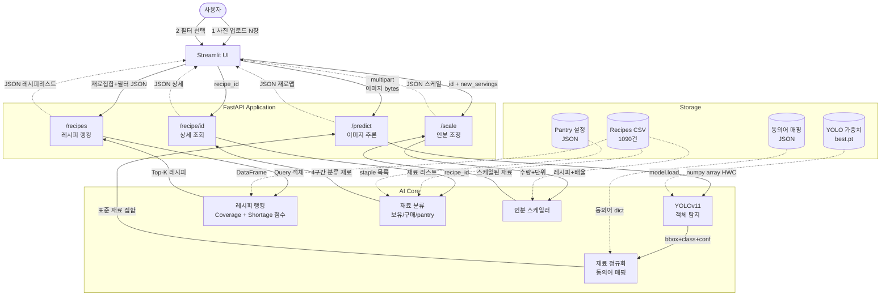

# 딥러닝실습 기말 프로젝트 계획서 (v3)
## 냉장고 AI: 이미지 기반 재료 인식 및 레시피 추천 End-to-End 시스템

> **과목**: 딥러닝실습 · **담당**: 구영현 교수님
> **제출**: PPT (본 문서는 9개 필수 목차 기준)
> **변경이력**:
> - v1: 초안 (2단계 파이프라인, YOLOv8)
> - v2: YOLOv11 주력 + v8 baseline, Ablation 5종
> - v3: 실제 데이터셋(`smart refrigerator.yolov11`) 반영, 단일 모델 전략, Architecture·Flow·데이터흐름 상세화
> - v3.1: 식약처 API 필수화, §1.4 프로젝트 범위 정의 신설 (추천시스템 오해 방지)
> - v3.2: §5.1.1 단일 모델 근거 강화 (세분 클래스 예시 + 5대 이점 표)
> - v3.3: §1.5 수업 연계성 섹션 제거 (후속 버전에서 필요 시 추가)
> - v3.4: §6.1 보조 지표 수치 목표치 + 근거 컬럼 추가 (평가 계획 완결성 강화)
> - v3.5: Cursor 피드백 1차 반영 — API 사용 시점 명시, Jaccard→Coverage 용어 통일, Top-K 유효 추천 운영 정의, 완화 조건 추가, Focal Loss·Grad-CAM 표현 조정
> - **v3.6: Cursor 피드백 2차 반영** — 개발 일정 16주→8주 축소, "(Week X 연계)" 태그 전체 제거, §2.1 ASCII 다이어그램 Jaccard→Coverage 최종 통일
> - **v3.7: SVG 다이어그램과의 정합성 확보** — §2.1 ASCII 다이어그램에서 Pantry Classifier와 Scaler를 독립 모듈로 분리, Ranker→Row 2 직접 화살표 제거 (§2.3 Request Flow 표와 일관성), Row 1/Row 2 역할 구분 설명 추가, S1~S5 저장소 접근 경로 명시
> - **v3.8: 진행 현황·최종 학습 결과·PPT 자료 매핑 반영** — valid+test 50:50 재분할(150/151), test mAP 0.87 확정, Ablation 재실행 예정, §6.4·부록 F 신설
> - **v3.9: Ablation 실험 1 결과 반영** — `presentation/ablation/ablation_results_1.json` (val mAP, 2895/150/151 split) §6.2 표·결론 업데이트
> - **v3.10: Ablation 실험 2 결과 반영** — `ablation_results_2.json` (Augmentation 5단계) §6.2 표·채택 증강 결론 업데이트
> - **v3.11: Ablation 실험 3 결과 반영** — `ablation_results_3.json` (Transfer Learning 3조건) §6.2 표·full fine-tune 채택 결론 업데이트
> - **v3.12: Ablation 4종 완료·본 학습 정합성** — `ablation_results_4.json`, §6.2.5 종합 표, `training/train_yolo_byclaude.py` 대조표, §5.1.2 Transfer Learning 수정
> - **v3.13: 레시피 필터 재설계** — DB 출처 + `cuisine_path` 카테고리 (Allrecipes L1 / 식약처 `/한식/{유형}`), §4.2.3·UI·API 갱신
> - **v3.14: UI·파서·메타데이터 정합** — Streamlit 한국어화, 상세 3열 재료 구분, 식약처 재료량 파싱, 한식 별점·시간 표시 규칙, §4.2.4·§5.2·부록 M
> - **v3.15: 재료 수동 보정·필터 건수 미리보기** — 2단계 YOLO 30클래스 직접 추가/수정/삭제, 3~5단계 괄호 숫자 = 6단계와 동일 조건의 추천 가능 건수, `ui/filter_counts.py`·`count_rankable_recipes()`, §4.2.4·§5.3·부록 N
> - **v3.16: 통합 재료 UI·자유 입력·식단 복수·페이지네이션·파서 보강** — 2단계 단일 표·단일 추가(백엔드 YOLO/custom 분기), `custom_match.py`·7단계 4열(기타 재료), 식단 **복수 AND**·토글 버튼, 6단계 **페이지당 20건**·`total_rankable`·`offset`, 파서 섹션 헤더·`supplement_from_directions`, §4.2.3~4.2.4·§5.2~5.4·부록 O
> - **v3.17: Docker + Google Cloud Run 배포 완료** — `Dockerfile`·`docker-compose.yml`·로컬 Compose 기동, Artifact Registry + Cloud Build + Cloud Run(`fridge-api`/`fridge-ui`) 공개 URL, §5.7·부록 P

---

## 📑 목차

1. 프로젝트 개요
2. 프로젝트 구성도 (Architecture · Flow · 데이터 흐름 명세)
3. 사용할 데이터셋
4. 데이터 전처리
5. 사용할 모델 및 로직 소개
6. 성능 평가 방안 (Ablation 포함)
7. 개발 일정
8. 활용 방안 및 한계
9. 참고문헌

---

# 1. 프로젝트 개요

## 1.1 배경 및 목적

가정 내 **식재료의 미활용과 유기** 문제, 그리고 **"오늘 무엇을 요리할지"** 결정하는 데 드는 시간 비용을 줄이기 위해, 냉장고 사진에서 재료를 자동 인식하고 사용자의 선호에 맞춰 레시피를 추천하는 End-to-End 딥러닝 시스템을 구축한다.

## 1.2 핵심 요구사항 (README 기준)

| 구분 | 내용 |
|---|---|
| 입력 | 냉장고 내부 사진 **다중 업로드** |
| 인식 | 객체 탐지 + **통합 재료 표** (인식·직접입력 구분 없음). 표에서 **−/+·삭제**, 이름 입력 **단일 추가** |
| 필터 (순차 UI) | **① DB 출처** · **② 카테고리** · **③ 식단**: 7종 **복수 선택(AND)** · 토글 버튼 UI |
| 추천 | 필터 반영 **전체 목록** — **페이지당 20건**, 이전/다음 페이지 |
| 상세 | 음식 사진·설명, **서빙 인원**(가변), 재료 **4구간**·용량, 조리법 — **출처별 메타 표시 다름 (§4.2.4)** |
| 재료 구분 (4구간) | **한 화면 4열**: 🧊 보유 / 🛒 추가 구매 / 🏠 상비재 / 📋 **기타**(YOLO 30종 밖·직접입력 매칭) |
| 인분 스케일링 | 서빙 인원 변경 시 재료 용량 **자동 비례 조정** (상세 화면) |
| 조리법 | 하단에 **번호 있는 단계별** 안내 |
| 제외 | 난이도 항목은 범위에서 제외 |

## 1.3 기술 목표

- **딥러닝**: 냉장고 도메인 **객체 탐지 (YOLOv11)** 학습·추론
- **애플리케이션**: **FastAPI** 추론 API + **Streamlit** UI + **Docker** 로컬 재현 + **Google Cloud Run** 공개 배포
- **데이터 활용 원칙**:
  - **구축 단계**: 식품의약품안전처 Open API로 한식 레시피 배치 수집 (1회성)
  - **런타임 단계**: 외부 API 호출 없이 **로컬 DB만 사용** → 네트워크 독립성 확보
- **데이터셋**: **Roboflow Smart Refrigerator YOLOv11** (3,196장, 30클래스) + 로컬 **Recipes CSV** (`recipes_merged.csv`) + 식약처 API 한식 보강

## 1.4 프로젝트 범위 정의 *(중요)*

> **본 프로젝트의 핵심 딥러닝 과제는 이미지 기반 재료 인식(Object Detection)이며, 레시피 추천은 인식 결과를 활용한 규칙 기반 랭킹 시스템으로 구현된다.**

이는 다음 근거에 기반한 설계 결정이다:

① **데이터 제약**: 사용자 상호작용 로그(평점·클릭 이력)가 부재하여 협업 필터링(Collaborative Filtering) 계열 모델 적용 불가
② **수업 연계성**: 수업 범위인 **CNN·Transfer Learning·Data Augmentation**의 적용과 정량 평가에 집중
③ **해석 가능성**: 단일 세션 데모 환경에서는 규칙 기반 랭킹이 결과 해석과 디버깅에 유리

따라서 성능 평가도 **재료 인식 지표(mAP, Recall)를 주 지표**로, **추천 품질은 보조 지표(Coverage, 부족재료 수)** 로 측정한다.

### 범위 내 vs 범위 외

| 범위 내 (딥러닝 과제) | 범위 외 (의도적 제외) |
|---|---|
| ✅ YOLOv11 기반 30종 재료 탐지 | ❌ 협업 필터링 / GNN 기반 추천 |
| ✅ Transfer Learning, Augmentation | ❌ 사용자 개인화 / 선호 학습 |
| ✅ Optimizer / Initialization Ablation | ❌ 레시피 생성 모델 (Inverse Cooking 등) |
| ✅ FastAPI + Streamlit + Docker·Cloud Run 배포 | ❌ Cold-start / Session-based RecSys |

---

# 2. 프로젝트 구성도

## 2.1 Layered Architecture

```
┌─────────────────────────────────────────────────────────────────┐
│  Client Layer — Streamlit Web UI                                │
│  (이미지 업로드 / 재료 확인 / 필터 선택 / 레시피 상세 화면)         │
└─────────────────────────────────────────────────────────────────┘
         │ ▲
  [이미지 파일 N장]  [JSON: 재료 목록, 추천 레시피, 상세]
         ▼ │
┌─────────────────────────────────────────────────────────────────┐
│  Application Layer — FastAPI                                    │
│  ┌─────────┐ ┌─────────┐ ┌───────────┐ ┌─────────┐             │
│  │/predict │ │/recipes │ │/recipe/id │ │/scale   │             │
│  └────┬────┘ └────┬────┘ └─────┬─────┘ └────┬────┘             │
└───────┼───────────┼────────────┼────────────┼──────────────────┘
        │           │            │            │
 [numpy array] [재료+필터]   [recipe_id]  [id+새인분]
        │           │            │            │
        │           │            │            │
        │           └──────┐     └──────┐     └────────┐
        ▼                  ▼            ▼              ▼
┌─────────────────────────────────────────────────────────────────┐
│  AI Core Layer                                                  │
│                                                                 │
│  Row 1 (내부 파이프라인 — /predict 및 /recipes 흐름)             │
│  ┌──────────┐    ┌───────────┐    ┌───────────┐                │
│  │YOLOv11   │ →  │재료 정규화│ →  │레시피 랭킹│                │
│  │30 classes│    │Normalizer │    │Ranker     │                │
│  └──────────┘    └───────────┘    └───────────┘                │
│                                                                 │
│  Row 2 (독립 모듈 — /recipe/id 및 /scale에서 개별 호출)         │
│  ┌───────────────────┐           ┌──────────────────┐          │
│  │Pantry Classifier  │           │Scaler            │          │
│  │보유/구매/pantry   │           │인분 비례 조정    │          │
│  └───────────────────┘           └──────────────────┘          │
│                                                                 │
└──┬──────────────┬──────────────┬────────────┬──────────────────┘
   │ S1           │ S2, S3, S5   │ S4         │
[가중치 로드]  [매핑/CSV 조회]  [staple 조회]
   ▼              ▼              ▼
┌─────────────────────────────────────────────────────────────────┐
│  Storage Layer                                                  │
│  ┌──────────┐  ┌──────────┐  ┌──────────┐  ┌──────────┐        │
│  │YOLO.pt   │  │recipes   │  │mapping   │  │pantry    │        │
│  │(weights) │  │  .csv    │  │  .json   │  │.json     │        │
│  └──────────┘  └──────────┘  └──────────┘  └──────────┘        │
└─────────────────────────────────────────────────────────────────┘
         │
   [Docker Compose (로컬) / Cloud Run (공개 URL)]
         ▼
┌─────────────────────────────────────────────────────────────────┐
│  Infrastructure Layer — Docker · Google Cloud Run               │
└─────────────────────────────────────────────────────────────────┘
```

**AI Core Layer 구성 설명**:
- **Row 1** (`YOLOv11 → Normalizer → Ranker`): `/predict` 및 `/recipes` 엔드포인트에서 호출되는 파이프라인. 이미지 추론(`/predict`)은 YOLOv11에서 시작해 Normalizer를 거쳐 표준 재료 집합을 반환하며, 레시피 랭킹(`/recipes`)은 UI에서 받은 재료 집합을 바탕으로 Ranker가 직접 Top-K를 계산한다.
- **Row 2** (`Pantry Classifier`, `Scaler`): 각각 `/recipe/{id}`, `/scale` 엔드포인트에서 **독립적으로 호출**되는 모듈이다. Ranker에서 Row 2로 직접 데이터가 흐르지는 않으며, Row 1과 Row 2는 동일 계층에 속한 별도 호출 경로에 해당한다.

**Storage Access 경로 (S1~S5, §2.3 (B) 참조)**:
- **S1**: YOLOv11 ← `best.pt` (서버 시작 시 1회)
- **S2**: Normalizer ← `mapping.json` (요청마다)
- **S3**: Ranker ← `recipes.csv` (시작 시 DF 로드)
- **S4**: Pantry Classifier ← `pantry.json` (요청마다)
- **S5**: Scaler ← `recipes.csv` (요청마다)

## 2.2 Flow Chart (Mermaid)



## 2.3 데이터 흐름 명세 (엣지별 상세)

### (A) 요청 흐름 — Request Flow

| # | 경로 | 데이터 형식 | 예시 |
|---|---|---|---|
| 1 | User → UI | 이미지 파일 N장 | `[img1.jpg, img2.jpg, img3.jpg]` |
| 2 | User → UI | 필터 선택 이벤트 | `{source:"foodsafety", category:"반찬", diets:["low-carb","sugar-free"]}` |
| 3 | UI → `/predict` | multipart/form-data | `files: List[bytes]` |
| 4 | `/predict` → YOLOv11 | numpy array | `shape=(640,640,3), dtype=uint8` |
| 5 | YOLOv11 → Normalizer | Detection 리스트 | `[{class:"onion", conf:0.92, bbox:[x,y,w,h]}, ...]` |
| 6 | Normalizer → `/predict` | 표준 재료 집합 | `{"onion":2, "carrot":3, "chicken":1}` |
| 7 | UI → `/recipes` | 재료+필터 JSON | `{ingredients:{...}, custom_ingredients:{...}, filters:{...}, top_k:20, offset:0}` |
| 8 | `/recipes` → Recipe Ranker | Query 객체 | `Query(ingredients, filters)` |
| 9 | Ranker → `/recipes` | 페이지 결과 + 총 건수 | `{results:[...], total_rankable, offset, page_size}` |
| 10 | UI → `/recipe/{id}` | URL 파라미터 | `GET /recipe/427` |
| 11 | `/recipe/{id}` → Pantry Classifier | Recipe 객체 | `Recipe(ingredients=[...])` |
| 12 | Classifier → `/recipe/{id}` | 4구간 분류 | `{owned, to_buy, pantry, extra}` |
| 13 | UI → `/scale` | 인분+ID | `{recipe_id:427, new_servings:4}` |
| 14 | `/scale` → Scaler | 배율 계산 | `ratio = new_servings / original` |
| 15 | Scaler → `/scale` | 스케일된 재료 | `[{name, quantity, unit}, ...]` |

### (B) 저장소 접근 — Storage Access

| # | 경로 | 읽기/쓰기 | 내용 |
|---|---|---|---|
| S1 | YOLOv11 ← `best.pt` | 서버 시작 시 1회 | 학습 완료 가중치 (30 classes) |
| S2 | Normalizer ← `mapping.json` | 요청마다 | `{"chicken_breast":["chicken","닭가슴살"], ...}` |
| S3 | Ranker ← `data/recipes_merged.csv` | 시작 시 DF 로드 | Allrecipes + 식약처 병합 |
| S4 | Pantry Classifier ← `pantry.json` | 요청마다 | `["water","salt","pepper","oil",...]` |
| S5 | Scaler ← `recipes.csv` | 요청마다 | 해당 recipe의 ingredients 필드 |

---

# 3. 사용할 데이터셋

## 3.1 데이터셋 구성 개요

| 모듈 | 데이터셋 | 규모 | 라이선스 | 역할 |
|---|---|---|---|---|
| **객체 탐지** | `smart refrigerator.yolov11` (Roboflow + 수동 큐레이션) | 3,196장, 30 classes | Roboflow Private | YOLOv11 학습 |
| **레시피 DB** | `data/recipes_merged.csv` | Allrecipes + 식약처 API 병합 | Allrecipes + 공공 API | 랭킹·필터·상세 |
| **인분 파싱** | `test_recipes.csv` | 59건, 11열 | 구조화된 수량·단위 | 스케일링 검증 |
| **한식 보강** | 식약처 Open API | 한식 중심 레시피 | 공공 데이터 | 한식 태그 확보 |

## 3.2 이미지·탐지 데이터 상세

**`smart refrigerator.yolov11` (Roboflow export + 수동 정리)**:
- 총 **3,196장**, YOLOv11 포맷 (`train/`, `valid/`, `test/`, `data.yaml`)
- **현재 split**: train **2,895** / valid **150** / test **151** (valid+test 합산 301장을 50:50 재분할, seed=42)
- **30개 클래스**: `apple, banana, beef, blueberries, bread, butter, carrot, cheese, chicken, chicken_breast, chocolate, corn, eggs, flour, goat_cheese, green_beans, ground_beef, ham, heavy_cream, lime, milk, mushrooms, onion, potato, shrimp, spinach, strawberries, sugar, sweet_potato, tomato`
- 한 이미지당 평균 **10~15개 bbox** → Instance 총 **약 30,000+개** (충분한 학습량)
- No pre-processing or augmentation applied → **본 프로젝트에서 증강 실험 설계 가능**

**분할 이력 (중요)**:
| 단계 | train / valid / test | 비고 |
|---|---|---|
| Roboflow 초기 export | 2,895 / 103 / 51 | test 51장 → 평가 불안정 (mAP 0.48) |
| valid+test 병합 후 50:50 | 2,895 / **150 / 151** | **최종 학습·평가에 사용** |

## 3.3 레시피 데이터 상세

**`recipes.csv`** (메인 DB):
| 필드 | 타입 | README 대응 |
|---|---|---|
| `recipe_name` | String | 레시피 제목 |
| `prep_time`, `cook_time`, `total_time` | String | **출처별 상이** — 아래 표 |
| `servings` | Integer | 기본 인분 |
| `ingredients` | String | 재료 텍스트 (파싱 필요) |
| `directions` | String | 번호 매긴 조리법 |
| `rating` | Float | **Allrecipes**: 사이트 사용자 평점 (2~5). **식약처**: 필드 없음 → 랭킹용 중립값 3.0 (UI 비표시, §4.2.4) |
| `cuisine_path` | String | **카테고리 필터** — Allrecipes: L1 path / 식약처: `/한식/{RCP_PAT2}` |
| `img_src` | String | **Allrecipes**: allrecipes.com 썸네일 · **식약처**: `ATT_FILE_NO_MK` URL (`foodsafetykorea.go.kr/uploadimg/...`) |
| `nutrition` | String | 식단 필터 보조 (저지방 등) |
| `source` | String | `allrecipes` \| `foodsafety` — 필터·UI 분기 |

**출처별 시간·이미지 (저장 시)**:

| 필드 | Allrecipes | 식약처 (foodsafety) |
|---|---|---|
| `prep_time` | `10 mins` 등 | *(빈 값)* |
| `cook_time` | `1 hrs` 등 | **`RCP_WAY2` 조리법** (찌기·볶기·굽기…) — **분 단위 아님** |
| `total_time` | `1 hrs 10 mins` 등 | *(빈 값)* |
| `img_src` | Allrecipes CDN | 식품안전나라 API 이미지 URL |
| `rating` | 실제 평점 | *(빈 값)* → 내부 3.0 |

**`test_recipes.csv`** (구조화 재료 파싱용):
- 59건에 대해 **수량·단위·이름이 분리된 형식** 제공
- 인분 스케일링 로직 검증에 활용

## 3.4 식약처 Open API 상세 *(한식 보강용 필수 구성요소)*

| 항목 | 내용 |
|---|---|
| 제공기관 | 식품의약품안전처 (식품안전나라) |
| 엔드포인트 | `openapi.foodsafetykorea.go.kr` |
| 인증 | 인증키 발급 필요 (무료, 1~3일 소요) |
| 호출 형식 | `GET /api/{key}/COOKRCP01/json/{start}/{end}` |
| 제공 필드 | 메뉴명(`RCP_NM`), 조리법(`MANUAL01~20`), 재료(`RCP_PARTS_DTLS`), 분류(`RCP_PAT2`), **조리방식(`RCP_WAY2`)**, 영양성분, **이미지(`ATT_FILE_NO_MK`)** |
| 일일 호출 제한 | 건수 제한 있음 (공식 문서 준수) |
| 활용 방식 | 초기 1회 **배치 수집 → 로컬 CSV 저장** 후 `recipes.csv`와 통합 |

**적용 방식**:
1. 프로젝트 시작 시 배치 크롤링으로 한식 레시피 N건 확보
2. 기존 `recipes.csv` 스키마로 변환·병합
3. `cuisine_path` 필드에 "한식" 태그 부여
4. 이후 런타임에는 로컬 DB만 사용 (API 호출 없음)

## 3.5 데이터 한계 및 대응

| 한계 | 대응 |
|---|---|
| **한식 특화 재료 부재** (김치, 두부, 된장 등) | YOLO 클래스에 없는 재료는 인식 불가 → 한계로 명시 |
| **한식 레시피 부족** | **식약처 Open API로 한식 보강 (§3.4)** |
| **영문 기반 레시피 DB** | 한국어 UI는 동의어 매핑 JSON으로 대응 |
| **`ingredients` 필드 비구조화** (자연어) | 정규식 파이프라인 — **Allrecipes 한 줄 쉼표 목록**, **식약처 `재료명(70g)`·`연두부 75g(3/4모)`** (§5.2) |
| **Valid/Test 소규모 분할** | valid+test 301장 50:50 재분할 완료 (§3.2) |

---

# 4. 데이터 전처리

## 4.1 이미지 전처리

### 4.1.1 기본 전처리
- Letterbox 리사이즈 → **640×640** (YOLOv11 입력)
- 정규화 (0~1 스케일, Ultralytics 내장)
- Train/Valid/Test 재분할 (80/10/10)

### 4.1.2 Data Augmentation (Ablation 대상)

### 4.1.2 Data Augmentation (Ablation 대상)

```python
# Stage 1: 기본 증강
- Mosaic (4-image)          # Ultralytics 기본
- HorizontalFlip (p=0.5)
- HSV jitter (hsv_h=0.015, hsv_s=0.7, hsv_v=0.4)
- Translate ±0.1, Scale ±0.5

# Stage 2: 고급 증강 (Ablation 실험)
- MixUp (α=0.1)
- CutMix
- Copy-Paste (작은 객체 대응)
- GaussNoise                # 냉장고 조명 노이즈 모사
- CLAHE                     # 어두운 냉장고 내부 보정
```

### 4.1.3 클래스 불균형 처리
- 30 클래스 분포 EDA 결과에 따라 다음 전략 중 채택:
  - **Weighted Random Sampling**: 희귀 재료 업샘플링 (1순위)
  - **Class-aware 데이터 증강**: 희귀 클래스에 더 강한 증강 적용
  - **커스텀 Loss 가중치** 조정 (Ultralytics 기본 설정 기준)
- *Focal Loss는 Ultralytics 기본 학습 흐름과 호환성 검토 후 보조적으로 도입 가능*

## 4.2 텍스트 전처리

### 4.2.1 재료 문자열 파싱 파이프라인

```
입력: "2 tablespoons olive oil\n1 (3 pound) whole chicken\n1 teaspoon salt\n..."
         ↓
[1] 줄 단위 split (\n)
[2] 정규식으로 수량·단위·이름 분리
    pattern: r"(\d+\.?\d*)\s*(\w+)\s+(.*)"
[3] 단수/복수 정리 (tomatoes → tomato)
[4] 동의어 매핑 (mapping.json)
    {"chicken": ["chicken_breast","닭고기","닭가슴살"], ...}
[5] Staple(pantry) 분리
    staples = ["water","salt","pepper","olive_oil","butter",...]
         ↓
출력: [{name:"chicken", qty:3, unit:"pound", is_staple:False},
       {name:"salt", qty:1, unit:"tsp", is_staple:True}, ...]
```

### 4.2.2 YOLO 클래스 ↔ 레시피 재료 매핑 (`mapping.json`)

```json
{
  "chicken_breast": ["chicken breast", "chicken", "boneless chicken"],
  "ground_beef": ["beef", "minced beef", "hamburger"],
  "heavy_cream": ["cream", "heavy whipping cream"],
  "...": "..."
}
```

→ 수작업 구축 (30 클래스 × 평균 3~5개 별칭) = **100~150 쌍** 예상
→ 일정표에 **1주** 별도 할당

### 4.2.3 레시피 필터 규칙 *(v3.13 — DB taxonomy 기반)*

> **ML 학습 없음** — `core/ranker.py` + `core/recipe_categories.py` 규칙.  
> Allrecipes(1,090건)와 식약처(~1,146건)는 **분류 체계가 다르므로 같은 드롭다운에 섞지 않음.**

#### UI 흐름 (Streamlit 7단계)

| 단계 | 화면 | API 필드 |
|:-:|---|---|
| 3 | **레시피 DB** — 전체 / 한식(식약처) / Allrecipes | `filters.source` |
| 4 | **카테고리** — 출처별 옵션 (아래 표) | `filters.category` |
| 5 | **식단** — 채식·비건·… (복수 AND) | `filters.diets[]` |

#### ① DB 출처 (`source`)

| 값 | 데이터 | 건수(병합본) |
|---|---|---|
| *(없음)* | 전체 검색 | ~2,107 |
| `foodsafety` | 식약처 API → `cuisine_path=/한식/{유형}` | ~1,146 |
| `allrecipes` | `Recipes Dataset/recipes.csv` | ~961 |

#### ② 카테고리 (`category`) — 출처별

**A. Allrecipes — `cuisine_path` 1단계(L1) prefix 매칭**

| category 값 | UI 라벨 | 대략 건수 |
|---|---|---|
| `Desserts` | 디저트·베이킹 | ~336 |
| `Side Dish` | 반찬·사이드 | ~120 |
| `Salad` | 샐러드 | ~85 |
| `Drinks Recipes` | 음료·스무디 | ~75 |
| `Breakfast and Brunch` | 아침·브런치 | ~45 |
| `Main Dishes` | 메인 요리 | ~40 |
| … | *(§`recipe_categories.py`)* | … |

- 예: `category=Desserts` → path `/Desserts/Fruit Desserts/...` **통과**
- **구 식사 필터(아침/디저트) 통합** — `Breakfast and Brunch`, `Desserts`, `Appetizers and Snacks` 등 L1로 대체

**B. 식약처 — `/한식/{RCP_PAT2}` 2단계 매칭**

| category 값 | UI 라벨 | 대략 건수 |
|---|---|---|
| *(없음)* | 한식 전체 | ~1,146 |
| `반찬` | 반찬 | ~574 |
| `일품` | 일품 (면·국수·만두·덮밥 등 **한 그릇 요리**) | ~171 |
| `후식` | 후식·디저트 | ~142 |
| `밥` | 밥·죽 | ~119 |
| `국&찌개` | 국·찌개 | ~103 |
| `기타` | 기타 | ~37 |

#### ③ 식단 (`diets`) — *(v3.16: 단일 → 복수 AND)*

| 필터 | 규칙 |
|---|---|
| 채식/비건/유제품 없음 | 파싱 재료 → YOLO 클래스 **금지 목록** (`DIET_FORBIDDEN`) |
| 저탄수/저지방/무설탕/고단백 | `nutrition` 문자열 **임계값** (+ YOLO 클래스 fallback) |
| **복수 선택** | `filters.diets: string[]` — **모든 조건을 동시에 만족(AND)**. 단일 `diet` 필드는 하위 호환 |

> **옵션별 괄호 건수(5단계)는 각 옵션을 단독 적용했을 때의 수**이며, 여러 옵션을 고르면 **교집합**이라 합산되지 않음.

#### 판정 코드 (`passes_filters`)

```
source   → recipe.source 일치 (foodsafety | allrecipes)
category → foodsafety: path[1]==유형 / allrecipes: path[0]==L1
diets    → active_diets() 각 항목에 _match_diet() — 전부 통과해야 함
→ AND 후 Coverage 랭킹
```

#### 폐기된 필터 (v3.12 이전)

| 구 필터 | 폐기 이유 |
|---|---|
| 식사 (breakfast/lunch/…) | Allrecipes path와 **중복·저커버**(아침 2.8%) |
| 5개국 요리 (한식/일식/…) | Allrecipes는 **나라 taxonomy 부재**(일식 4건) · 한식=식약처만 해당 |

> **카테고리 개수**: 한식 **6** + Allrecipes L1 **13** = 서로 다른 필터 값 **19** (출처별 택1). 정의: `core/recipe_categories.py`.

### 4.2.4 Streamlit UI · 출처별 메타 표시 *(v3.14 → v3.16)*

#### UI 공통

- **언어**: Streamlit 크롬(단계 제목·버튼·테이블 헤더) **한국어**. API `source`/`category`/`diets` 값은 코드용 영문·한글 유지.
- **실행**: `scripts/run_api.py` (:8000) + `scripts/run_ui.py` (:8501). 코드 수정 후 **서버 재시작** + 브라우저 강력 새로고침 권장. (`ui/filter_counts.py`·`ui/app.py` 변경 시 Streamlit **캐시** 때문에 재시작 필수.)

#### 2단계 — 재료 확인 *(v3.15 → v3.16 통합 UI)*

| 기능 | 규칙 |
|---|---|
| **표시** | YOLO `/predict` + 사용자 추가 재료를 **하나의 표**에 통합. **인식/범위외 구분 열 없음** |
| **검색** | 한·영 재료명으로 표 필터 |
| **표에서 수정** | 각 행 **− / +** 로 수량 변경, **삭제** 버튼으로 즉시 제거 (별도 수정 드롭다운 없음) |
| **재료 추가 (단일 입력)** | 이름 + 개수 + **추가** 한 세트. `mapping_ko.json` 별칭과 일치하면 → `ingredients`(YOLO), 아니면 → `custom_ingredients`(자유 입력) |
| **백엔드** | 세션·API는 **`ingredients` + `custom_ingredients` 분리 유지**. UI만 통합 |
| **다음 단계** | 두 dict 합쳐 1종 이상일 때만 3단계 진행 |

> 예: `양파` → `onion` · `김치` → custom. 직접 추가 YOLO 클래스는 `manual_ingredients`로 추적(내부용).

#### 3~5단계 — 필터 옵션 건수 *(v3.15 → v3.16)*

- 라디오/버튼 라벨 예: `전체 (한식 + 양식) (471)`, `반찬 (83)`, `저탄수화물 (69)`.
- **괄호 안 숫자** = **현재 2단계 재료** 기준, 해당 옵션(또는 식단 옵션 **단독**) 적용 시 rankable 수.
- **DB 전체 건수 아님**. **카테고리**(4단계)는 상호 배타·합 일치. **식단**(5단계)은 **겹칠 수 있어** 옵션 합 ≠ 전체.
- 5단계 **복수 식단** 선택 시 **`diet_combo_count()`** 로 **「현재 선택 조합: N건」** 표시 (실제 6단계 총 수).
- 5단계 UI: **토글 버튼 7종** (2열). 선택됨 = primary, 미선택 = secondary. 드롭다운·라디오 없음.
- 구현: `ui/filter_counts.py` → `core/ranker.py` **`count_rankable_recipes()`**.

#### 6단계 — 추천 목록 *(v3.16 페이지네이션)*

| 항목 | 규칙 |
|---|---|
| **표시 건수** | **페이지당 20건** (`RECIPES_PAGE_SIZE`). **← 이전 / 다음 →** 로 전체 탐색 |
| **캡션** | `총 N건 · a–b번째 표시` — N = API `total_rankable`, a–b = 현재 페이지 구간 |
| **API** | `POST /recipes` — `top_k`(=20), `offset`, 응답 `total_rankable`·`page_size`·`offset` |
| **정렬** | 동일 `rank_recipes()` 점수순. offset은 정렬 후 슬라이스 |

#### 6·7단계 — 출처별 메타 표시

| 항목 | 한식 (`foodsafety`) | 양식 (`allrecipes`) |
|---|---|---|
| **별점** | **숨김** (API에 평점 없음; 랭킹만 중립 3.0) | 목록·상세에 **별점 표시** |
| **시간** | **`조리방법: 볶기`** 등 (`cook_time` = `RCP_WAY2`) | **`⏱ 준비 · 조리 · 총`** (분/시간 문자열) |
| **이미지** | 식품안전나라 `uploadimg/cook/...` URL | Allrecipes 썸네일 URL |

#### 7단계 — 재료 구분 (4열, 탭 없음) *(v3.16)*

| 열 | 규칙 |
|---|---|
| 🧊 **냉장고 보유** | YOLO 탐지 + **직접입력 custom 매칭** (`custom_matched`) + **인분 기준 필요량** |
| 🛒 **추가 구매** | **부족 1~2개**일 때만. YOLO `missing` 매칭. **상비·기타 제외** |
| 🏠 **상비 재료** | `pantry.json` 매칭. **추가 구매·기타에 포함 안 함** |
| 📋 **기타 재료** | 레시피 **unmapped**(YOLO 30종 밖). `custom_ingredients`와 **부분 이름 매칭** (예: 김치 ↔ 배추김치). `extra` / `extra_matched` |

- 인분(`servings`) 변경 시 **`/scale` 자동 호출** + 4구간·전체 재료표에 스케일 반영.
- 조리법: API **`_directions_list`** 이중 번호 제거.

---

# 5. 사용할 모델 및 로직 소개

## 5.1 모델 전략 — **단일 YOLOv11** (v2에서 변경)

### 5.1.1 단일 모델 전략의 근거 *(중요)*

**Roboflow Smart Refrigerator 데이터셋의 30개 클래스는 이미 실용적 수준으로 세분되어 있다:**

| 상위 개념 | 세분 클래스 |
|---|---|
| 닭고기 | `chicken` (닭 전체) / `chicken_breast` (가슴살) |
| 소고기 | `beef` (덩어리) / `ground_beef` (다진 것) |
| 치즈 | `cheese` (일반) / `goat_cheese` (염소) |
| 감자류 | `potato` / `sweet_potato` |
| 베리류 | `blueberries` / `strawberries` |
| 과일 | `apple` / `banana` / `lime` / `tomato` |

따라서 **추가 분류기(예: EfficientNet) 없이도 단일 탐지 모델만으로 세부 재료 인식이 가능**하며, 이는 다음 이점을 제공한다:

| 이점 | 상세 |
|---|---|
| ① **파이프라인 단순화** | 단일 모델만 유지보수, 배포 복잡도 ↓ |
| ② **추론 속도 향상** | 단일 forward pass로 탐지+분류 동시 수행 |
| ③ **학습·디버깅 효율** | 실험 반복 속도 ↑, 문제 원인 추적 용이 |
| ④ **오류 전파 감소** | Stage 1 오차가 Stage 2로 누적되지 않음 |
| ⑤ **학습 데이터 효율** | 단일 모델에 집중 투입, 분할 없이 활용 |

### 5.1.2 YOLOv11 (주력)

| 항목 | 내용 |
|---|---|
| 모델 | YOLOv11n (경량), YOLOv11s (정확도) |
| 사전학습 | COCO pretrained |
| 입력 | 640×640 RGB |
| 출력 | 30 classes × bbox × confidence |
| Transfer Learning | **COCO pretrained, full fine-tune** *(Ablation exp3: freeze·scratch 배제)* |
| Optimizer | AdamW (weight_decay=5e-4) |
| Scheduler | CosineAnnealingLR |
| Loss | CIoU + BCE (Ultralytics 내장) |

### 5.1.3 YOLOv8 (Baseline) *(Ablation 비교용)*

동일 설정으로 학습하여 **"최신 모델 선택이 근거 있는 결정"** 임을 정량 증명.

## 5.2 재료 정규화·파싱 모듈

- 동의어 매핑 사전 (`mapping.json`, `mapping_ko.json`) 기반
- 한국어 ↔ 영문 양방향 매핑
- 단수/복수/형태 정규화

**`ingredient_parser.py` — 재료 문자열 파싱 *(v3.14 → v3.16)*:**

| 출처 | 입력 예 | 파싱 규칙 |
|---|---|---|
| **Allrecipes** | `2 nectarines, pitted and diced, ¼ cup onion, …` (한 줄) | **새 재료 시작 쉼표**에서만 분리 (`_split_english_ingredients`) |
| **식약처** | `돼지고기(70g), 콩나물(150g), …` | **`재료명(숫자+단위)`** (`KO_ITEM_NAME_PARENS`) |
| **식약처** | `연두부 75g(3/4모)` | **앞쪽 g/ml 숫자** 사용 (`KO_ITEM_WEIGHT_EXTRA`) |
| **식약처** | `양념장 : 다진쇠고기 10g, …` / `•필수 재료 :` / `•육수 재료 :` | **`SECTION_HEADER`** 접두·불릿 제거 후 **뒤 재료 파싱** (헤더만 버리지 않음) |
| **공통** | `salt to taste`, `olive oil` | `pantry.json` 상비 매칭 — **red pepper flakes ≠ 후추** 오매칭 방지 |
| **공통** | `버섯마늘소금` 등 복합명 | **`_expand_embedded_staples`** — 내포 상비(소금 등) 분리, YOLO 오매칭 방지 |

**조리법 보강 (`supplement_from_directions`, v3.16):**

- `RecipeStore._load()` 시 재료 필드에 없고 **조리법 텍스트에만** 등장하는 항목을 `mapping`/`pantry` 사전으로 **규칙 기반 추가** (ML 없음).
- 예: 양념장 줄 누락·조리법에만 언급된 재료 보완.

파싱 실패 시 UI에 「기호에 따라」로 표시될 수 있음 → §3.5 한계.

**`core/custom_match.py` — 자유 입력 재료 매칭 *(v3.16)*:**

- `custom_ingredients`: UI/API에서 YOLO 30종 밖 사용자 입력 (예: `{"김치": 1}`).
- 레시피 `unmapped` 항목과 **정규화·부분 문자열** 매칭 (`김치` ↔ `배추김치`).
- 랭킹 Coverage·`detected_used`·7단계 **기타/보유** 분류에 반영.

## 5.3 레시피 랭킹 모듈

```
Score(recipe) = α × Coverage
              + β × (1 / (부족재료수 + 1))
              + γ × rating_normalized

where:
  Coverage = |인식재료 ∩ 레시피재료| / |레시피재료|
  α=0.5, β=0.3, γ=0.2  (초기값, 튜닝 대상)

Hard filter:
  - DB 출처(source) · 카테고리(category) · 식단(diets[]) — §4.2.3, **복수 식단 AND**
  - 부족재료 > 2 → 제외
  - (YOLO 재료 ∪ custom_ingredients) 와 레시피 필수 재료 교집합 ≥ 1 (overlap)

Coverage (v3.16):
  - YOLO requirements + unmapped(custom 매칭) + custom 직접 기여
  - `_combined_coverage()`, `_effective_detected_used()`
```

**6단계 목록 vs 3~5단계 건수 *(v3.15 → v3.16)*:**

- `_qualifies_for_ranking()` — 필터 통과 + overlap + shortage ≤ 2 (공통 자격 판정)
- `count_rankable_recipes()` — 위 조건을 만족하는 레시피 **개수** (점수 정렬 없음)
- `rank_recipes(..., top_k, offset)` — 동일 자격 후 Coverage 점수로 정렬 → **`[offset:offset+top_k]`** 슬라이스
- API `RecipesResponse`: `total_rankable`, `count`, `offset`, `page_size`
- 5단계 **식단 복수** 시 `diet_combo_count()` = 6단계 `total_rankable` 과 일치

## 5.4 재료 4구간 분류 모듈 *(v3.16: 3→4구간)*

```python
# core/pantry.py — classify_ingredients()
for item in parsed_ingredients:
    if item.is_staple:
        pantry.append(item)          # 상비 → to_buy·extra 절대 포함 안 함
    elif item.yolo_class in detected or custom_matches_item(...):
        owned.append(item)           # YOLO 또는 custom 매칭 → 보유
    elif item.yolo_class is None:    # unmapped
        extra.append(item)           # 기타 — custom과 매칭 시 extra_matched
    else:
        to_buy.append(item)          # yolo_class 기준 dedupe

# UI 표시 (ui/app.py):
#   추가 구매: shortage in {1,2} 이고 missing YOLO 클래스와 매칭된 to_buy만
#   기타: extra / extra_matched — 4번째 열
#   각 구간: scale_item_quantity() + format_amount_display()
```

## 5.5 인분 스케일링

```
사용자가 서빙 인원 N → M 변경 (상세 화면, 자동):
  주재료: qty × (M / N)
  양념·상비: qty × (M / N)^0.7
  `/scale` API: 상비 제외 목록 (전체 재료표)
  4구간 UI: pantry 포함 스케일 (`core/pantry.scale_item_quantity`)
```

## 5.6 서빙 스택

- **FastAPI**: `/predict`, `/recipes`, `/recipe/{id}`, `/scale` (+ `/health`)
- **Streamlit**: 7개 화면 구현
- **Docker Compose** (로컬): `docker compose up --build` — API·UI 2컨테이너, 동일 이미지
- **Google Cloud Run** (공개): `fridge-api` + `fridge-ui` 2서비스, Artifact Registry 이미지

## 5.7 배포 — Docker & Cloud Run

### 한눈에 보기

```
[개발]  run_api.py + run_ui.py     → Mac 로컬, 코드 수정용
[로컬]  docker compose up          → 재현성 검증, 발표 전 리허설
[공개]  Cloud Run URL              → 인터넷 어디서나 접속 (발표·시연용)
```

| 단계 | 무엇을 | 결과 |
|:---:|---|---|
| 1 | `Dockerfile` 작성 | Python 3.11 + requirements + `best.pt` + 앱 코드 |
| 2 | `docker-compose.yml` | `fridge-api`(8000) + `fridge-ui`(8501), UI→API는 `http://api:8000` |
| 3 | 로컬 빌드·실행 | `docker compose up --build` (~5–15분, PyTorch) |
| 4 | GCP 준비 | 프로젝트 `fridge-ai-demo`, gcloud CLI, API 활성화 |
| 5 | Cloud Build | `gcloud builds submit --tag ...` (~8분) → Artifact Registry |
| 6 | Cloud Run API | YOLO 포함, **4Gi RAM**, port 8000 |
| 7 | Cloud Run UI | Streamlit, **1Gi RAM**, `API_URL`=API Cloud Run URL |

### 공개 URL (현재 운영)

| 서비스 | URL |
|---|---|
| **Streamlit UI** (시연용) | https://fridge-ui-579587565890.asia-northeast3.run.app |
| **FastAPI Swagger** | https://fridge-api-579587565890.asia-northeast3.run.app/docs |

- **GCP 프로젝트**: `fridge-ai-demo`
- **리전**: `asia-northeast3` (서울)
- **이미지**: `asia-northeast3-docker.pkg.dev/fridge-ai-demo/fridge-ai/fridge-ai:latest`

### 로컬 Docker

```bash
cd ~/Documents/fridge-ai
chmod +x scripts/docker-up.sh   # 최초 1회
./scripts/docker-up.sh
# 또는: COMPOSE_BAKE=false docker compose up --build
```

| 주소 | 내용 |
|---|---|
| http://127.0.0.1:8501 | Streamlit UI |
| http://127.0.0.1:8000/docs | API Swagger |

한글 경로 Buildx 오류 시 `COMPOSE_BAKE=false` 또는 영문 경로(`~/Documents/fridge-ai`) 사용. 상세: [`../README.md`](../README.md).

### Cloud Run 재배포 (코드 수정 후)

```bash
gcloud builds submit --tag \
  asia-northeast3-docker.pkg.dev/fridge-ai-demo/fridge-ai/fridge-ai:latest
# fridge-api → fridge-ui 순으로 gcloud run deploy (README §Cloud Run 참조)
```

### 운영 참고

| 항목 | 내용 |
|---|---|
| Cold start | 첫 요청 시 YOLO 로딩 → 30초~1분 ( `--min-instances 1` 로 완화 가능, 유료) |
| 이미지 크기 | PyTorch+CUDA 포함 → **목표 3GB 초과** (Cloud Run은 동작, 향후 CPU-only torch로 축소 가능) |
| ONNX | 계획서 Week 7 선택 과제 — **미실시** (Cloud Run 배포 우선 완료) |

---

# 6. 성능 평가 방안

## 6.1 모델 정량 지표

> **본 프로젝트는 재료 인식이 핵심 딥러닝 과제이므로, 탐지 성능 지표가 주 지표이며 추천 품질은 보조 지표로 활용한다.**

### 🎯 주 지표: YOLOv11 탐지 성능 *(딥러닝 모델 평가)*

| 지표 | 목표 | **최종 결과 (test 151장)** | 달성 |
|---|---|---|:-:|
| mAP@0.5 | ≥ 0.70 | **0.870** | ✅ |
| mAP@0.5:0.95 | ≥ 0.45 | **0.569** | ✅ |
| Recall (전체 평균) | ≥ 0.70 | **0.879** | ✅ |
| 추론 속도 (GPU) | ≤ 10ms/image | **9.2 ms** (P95 11.4 ms) | ✅ |

> **공식 보고 지표는 test set(151장) 기준.** 학습 중 val(150장) best mAP@0.5 ≈ 0.825 (epoch 42, EarlyStopping). val만으로 최종 성능을 대체하지 않는다.

**약한 클래스 (test, 발표 시 한계로 언급)**:

| 클래스 | test mAP@0.5:0.95 | 비고 |
|---|---|---|
| beef | 0.285 | ground_beef와 혼동 |
| chicken_breast | 0.357 | chicken과 혼동 |
| ham | 0.232 | Recall 0.48 — 미탐多 |
| goat_cheese | 0.396 | 샘플 수 적음 |

**학습 설정 (Kaggle, `training/train_yolo_byclaude.py`)**: YOLOv11n, COCO pretrained, AdamW lr=0.001, CosineAnnealingLR, 100 epoch (EarlyStop @62, best @42), batch=16, imgsz=640, 가중치 `best.pt`.

### 📊 보조 지표: 레시피 추천 시스템 품질 *(규칙 기반 랭킹 평가)*

| 지표 | 정의 | 목표 | 근거 |
|---|---|---|---|
| Coverage Ratio (평균) | 인식재료 ∩ 레시피재료 / 레시피재료 | **≥ 0.60** | 평균 60% 이상 재료 보유 시 실제 요리 가능 |
| 부족재료 ≤ 2 만족률 | Top-5 추천 중 부족재료 2개 이하 비율 | **≥ 80%** | README 요구사항 반영 (추가구매 최대 2개) |
| Top-K Precision (K=5) | 상위 5개 중 유효 추천 비율 | **≥ 0.70** | 일반적 추천 시스템 합리적 목표치 |
| 정성 평가 | 10~20명 설문, 5점 척도 | **평균 ≥ 4.0 / 5.0** | 4점(만족) 이상 = 실서비스 가능 기준 |

> **"유효 추천"의 운영 정의**:
> 다음 **3가지 조건을 모두 충족**할 때 유효 추천으로 간주한다.
> ① 필터 일치: `source`·`category`·`diets[]` Hard filter 통과 (§4.2.3)
> ② 부족재료 ≤ 2: 추가 구매 재료가 2개 이하
> ③ 인식 재료 포함: 인식된 재료 중 **최소 1개 이상**이 레시피에 포함
>
> 이 정의는 규칙 기반으로 자동 산출 가능하며, 별도 인간 라벨링이 불필요하다.

## 6.2 Ablation Study *(핵심 — 수업 연계 증명)*

> **Ablation 상태** — **4/4 완료** ✅
> - ✅ **실험 1** — `presentation/ablation/ablation_results_1.json` (split 2895/150/151, 50 epoch, **val mAP**)
> - ✅ **실험 2** — `presentation/ablation/ablation_results_2.json` (Augmentation 5단계, YOLOv11n 고정)
> - ✅ **실험 3** — `presentation/ablation/ablation_results_3.json` (Transfer Learning 3조건, YOLOv11n 고정)
> - ✅ **실험 4** — `presentation/ablation/ablation_results_4.json` (Optimizer 3종, YOLOv11n 고정)
> - ❌ 프로젝트 **루트** `ablation_results_1~4.json` — leakage split 기준 → **폐기**

**Kaggle 실행**:
```bash
!pip install -q ultralytics pyyaml
!python training/ablation_yolo.py --exp 1   # 아키텍처
!python training/ablation_yolo.py --exp 2   # Augmentation
!python training/ablation_yolo.py --exp 3   # Transfer Learning
!python training/ablation_yolo.py --exp 4   # Optimizer
```
산출물: `ablation_results_1.json` ~ `_4.json` → `presentation/ablation/`에 저장 권장

### 실험 1: YOLO 아키텍처 비교 *(val 150장, 50 epoch, AdamW 공통)*

| Model | Params | mAP@0.5 (val) | mAP@0.5:0.95 | Recall | GPU Inference | Size |
|---|:-:|:-:|:-:|:-:|:-:|:-:|
| YOLOv8n (baseline) | 3.2M | 0.823 | 0.540 | 0.836 | 6.9ms | 6.2MB |
| YOLOv8s | 11.2M | **0.828** ★ | **0.549** | 0.863 | 10.7ms | 21.5MB |
| **YOLOv11n (채택)** | 2.6M | 0.826 | 0.548 | 0.847 | 9.3ms | 5.4MB |
| YOLOv11s | 9.5M | 0.819 | 0.548 | 0.865 | 10.8ms | 18.4MB |

> ★ Ablation val mAP@0.5 1위 = YOLOv8s (0.828). 네 모델 모두 **0.82~0.83**으로 격차는 **0.005 이내**로, val 150장·50 epoch 조건에서는 **통계적으로 유의미한 차이라고 단정하기 어렵다.**

**최종 채택: YOLOv11n — 상세 근거**

| 비교 축 | YOLOv8s (val 1위) | YOLOv11n (채택) | 판단 |
|---|---|---|---|
| val mAP@0.5 (Ablation, 50ep) | **0.828** | 0.826 (−0.002) | **실질 동률** — 0.2%p 차이 |
| val mAP@0.5:0.95 | **0.549** | 0.548 (−0.001) | 거의 동일 |
| **test mAP@0.5 (100ep, §6.1)** | *(Ablation 미측정)* | **0.870** | **공식 지표는 test** — 메인 학습으로 검증 |
| 파라미터 | 11.2M (v8n 대비 **4.3×**) | **2.6M (최소)** | Docker·모바일 확장(v4) 대비 유리 |
| 가중치 크기 | 21.5MB | **5.4MB** | 배포·전송 부담 적음 |
| GPU 추론 | 10.7ms (목표 10ms **초과**) | **9.3ms** | §6.1 목표(≤10ms) **충족** |
| 아키텍처 세대 | YOLOv8 (baseline) | **YOLOv11 (본 과제 주력)** | 계획서 §5·수업 연계(최신 Transfer Learning) |

**모델별 탈락·선정 이유**

1. **YOLOv8n** — val·속도는 양호(6.9ms)하나 파라미터 3.2M으로 v11n(2.6M)보다 무겁고, test 0.870 검증은 v11n만 수행. v8 baseline 역할로 Ablation 표에만 유지.
2. **YOLOv8s** — val mAP50·50-95 최고이나 **11.2M·10.7ms**로 “경량 실시간 탐지” 목표(§6.1, §8.1 v4 ONNX Mobile)와 충돌. val 0.002p 이득으로 4배 파라미터·추론 지연을 정당화하기 어려움.
3. **YOLOv11s** — Recall 0.865로 v11n(0.847)보다 높으나 val mAP50 **0.819로 4종 중 최하**. 9.5M·10.8ms로 n 대비 이점 없음.
4. **YOLOv11n** — Ablation val에서 v8s와 **동급**(0.826 vs 0.828), **100 epoch 본 학습**에서 test **0.870 / Recall 0.879** 달성, **2.6M·9.3ms**로 성능·경량·속도 균형 최적.

**평가 조건 차이 (발표 시 한 줄로 명시)**

- Ablation 실험 1: **50 epoch · val 150장** → 아키텍처 **상대 비교**용
- 최종 `best.pt`: **100 epoch · test 151장** → **공식 성능·배포**용  
→ “Ablation에서 v8s가 val 1위였어도, **동일 조건 격차 0.002**이고 **실서비스 기준(test·속도·용량)은 YOLOv11n**”이라고 설명한다.

**결론**: 최신 아키텍처(YOLOv11)가 v8 대비 val에서 열세가 아니며(0.826 vs 0.823~0.828), **test 일반화(0.870) · 추론 속도(9.3ms) · 모델 경량(2.6M)** 을 동시에 만족하는 **YOLOv11n**을 최종 탐지 모델로 확정한다.

**출처**: Kaggle `training/ablation_yolo.py --exp 1` → `presentation/ablation/ablation_results_1.json`

### 실험 2: Data Augmentation 전략 비교 *(YOLOv11n 고정, val 150장, 50 epoch)*

| 증강 전략 | mAP@0.5 (val) | mAP@0.5:0.95 | Recall | Δ mAP@0.5 (vs None) |
|---|:-:|:-:|:-:|:-:|
| **None** (증강 OFF) | 0.778 | 0.478 | 0.782 | — |
| Mosaic 단독 | 0.825 | 0.539 | 0.851 | **+0.047** |
| + HSV / Flip / Translate | **0.826** ★ | **0.548** ★ | 0.847 | **+0.047** |
| + MixUp (0.1) | 0.820 | 0.542 | 0.824 | +0.042 |
| + Copy-Paste (0.1) | 0.820 | 0.542 | 0.824 | +0.042 |

> ★ val mAP@0.5·0.5:0.95 1위 = **Mosaic + HSV + Flip + Translate** (`exp2_mosaic_hsv_flip`). 실험 1 YOLOv11n(0.826 / 0.548)과 **동일** → 설정 재현성 확인.

**단계별 해석**

| 단계 | 관찰 | 의미 |
|---|---|---|
| None → Mosaic | 0.778 → 0.825 (**+4.7%p**) | **Mosaic이 가장 큰 성능 기여** — 다중 재료·밀집 bbox 학습에 필수 |
| Mosaic → +HSV/Flip/Translate | 0.825 → 0.826 (mAP50), 0.539 → **0.548** (mAP50-95) | mAP@0.5 차이는 미미하나 **bbox 정밀도(mAP50-95) 개선** |
| +MixUp / +Copy-Paste | 0.826 → **0.820**, Recall 0.847 → **0.824** | 고급 증강은 **역효과** — full_aug와 full_aug_cp **수치 동일**(Copy-Paste 효과 없음) |

**최종 채택 증강 (본 학습 `training/train_yolo_byclaude.py`와 동일)**

```
Mosaic=1.0, HSV(h/s/v), Flip(lr=0.5), Translate, Scale
MixUp=0, Copy-Paste=0   ← Ablation에서 성능·Recall 모두 하락 → 미사용
```

**결론**: 냉장고 도메인에서는 **Mosaic 기반 증강이 필수**이며, HSV·Flip·Translate까지가 최적. MixUp·Copy-Paste는 50 epoch·본 데이터셋 기준 **추가 이득 없음** → 계획서·본 학습 모두 **mosaic_hsv_flip 수준**으로 확정.

**출처**: Kaggle `training/ablation_yolo.py --exp 2` → `presentation/ablation/ablation_results_2.json`

### 실험 3: Transfer Learning 효과 검증 *(YOLOv11n 고정, val 150장, 50 epoch, 실험 2 증강 동일)*

| 초기 가중치 | Freeze 전략 | mAP@0.5 (val) | mAP@0.5:0.95 | Recall | Precision | 학습 시간 | GPU |
|---|---|:-:|:-:|:-:|:-:|:-:|:-:|
| Random (`yolo11n.yaml`, scratch) | - | 0.808 | 0.516 | 0.811 | 0.853 | 22.5분 | 8.4ms |
| **COCO pretrained (full fine-tune)** ★ | 없음 | **0.826** | **0.548** | **0.847** | **0.872** | 27.8분 | 8.4ms |
| COCO pretrained | Backbone freeze (0~9) | 0.822 | 0.534 | 0.841 | 0.852 | **20.1분** | 9.1ms |

> ★ val mAP@0.5·0.5:0.95 1위 = **COCO full fine-tune** (`exp3_finetune`). 실험 1 YOLOv11n·실험 2 `mosaic_hsv_flip`과 **동일**(0.826 / 0.548) → 설정 재현성 확인.

**조건별 해석**

| 비교 | mAP@0.5 | mAP@0.5:0.95 | Recall | 학습 시간 | 의미 |
|---|---:|---:|---:|---:|---|
| scratch → full fine-tune | +0.018 | +0.032 | +0.037 | +5.3분 | **COCO 사전학습 효과** — train 2,895장에서도 pretrain이 val·Recall 모두 개선 |
| full fine-tune → freeze_bb | −0.004 | −0.014 | −0.006 | **−7.7분** | backbone freeze는 **속도↑·성능↓** 트레이드오프 — bbox 정밀도(mAP50-95) 손실 큼 |
| scratch vs freeze_bb | +0.014 | +0.018 | +0.030 | −2.4분 | freeze만으로는 scratch 대비 mAP50-95 **역전 불가** — head만 학습으로는 한계 |

**최종 채택: COCO pretrained + full fine-tune (본 학습 `training/train_yolo_byclaude.py`와 동일)**

```
초기 가중치 : yolo11n.pt (COCO pretrained)
학습 전략   : freeze=None — backbone·head 전체 fine-tune
scratch     : Ablation 비교용 — 배포 모델 아님
freeze_bb   : Ablation 비교용 — 7.7분 단축 vs mAP50-95 −1.4%p
```

**결론**: COCO Transfer Learning은 scratch 대비 val mAP@0.5 **+1.8%p**, Recall **+3.7%p**로 **정량적 이득**이 확인된다. Backbone freeze는 학습 시간 28% 단축(20.1분)이나 mAP@0.5:0.95 **−1.4%p**로 bbox 정밀도가 희생된다. **full fine-tune**이 Ablation·본 학습·`best.pt`(test 0.870) 전략과 일치하므로 최종 초기화 방식으로 확정한다.

**출처**: Kaggle `training/ablation_yolo.py --exp 3` → `presentation/ablation/ablation_results_3.json`

### 실험 4: Optimizer · Learning Rate 비교 *(YOLOv11n 고정, val 150장, 50 epoch, 실험 2·3 증강·pretrain 동일)*

| Optimizer | LR | Scheduler | mAP@0.5 (val) | mAP@0.5:0.95 | Recall | Precision | 학습 시간 | GPU |
|---|---|---|:-:|:-:|:-:|:-:|:-:|:-:|
| **AdamW** ★ | 0.001 | CosineAnnealingLR (`cos_lr=True`) | **0.826** | **0.548** | 0.847 | **0.872** | 28.3분 | 8.5ms |
| SGD + Momentum | 0.01 | linear decay* | 0.822 | 0.541 | 0.840 | 0.867 | **19.8분** | 8.5ms |
| Adam | 0.001 | 없음 (`cos_lr=False`, wd=0) | 0.815 | 0.538 | **0.853** | 0.872 | 25.7분 | 8.6ms |

\*Ablation 코드: `cos_lr=False` → Ultralytics 기본 linear LR decay (계획서 StepLR과 유사)

> ★ val mAP@0.5·0.5:0.95 1위 = **AdamW + CosineAnnealingLR** (`exp4_adamw`). 실험 1~3 채택 설정과 **동일**(0.826 / 0.548) → **4종 Ablation 재현성 확인**.

**조건별 해석**

| 비교 | mAP@0.5 | mAP@0.5:0.95 | Recall | 학습 시간 | 의미 |
|---|---:|---:|---:|---:|---|
| AdamW → SGD | −0.004 | −0.007 | −0.008 | **−8.5분** | SGD는 YOLO 관례 설정이나 **bbox 정밀도·mAP 열세** — 속도만 유리 |
| AdamW → Adam | −0.011 | −0.010 | +0.006 | −2.6분 | Adam 단독은 Recall↑·mAP↓ — **weight decay·Cosine 없으면 과적합/Recall 편향** |
| SGD vs Adam | +0.007 | +0.003 | −0.013 | −5.9분 | SGD가 Adam보다 mAP 우위 — lr·scheduler 튜닝 민감 |

**최종 채택 Optimizer (본 학습 `training/train_yolo_byclaude.py`와 동일)**

```
optimizer="AdamW", lr0=0.001, weight_decay=0.0005, cos_lr=True
SGD / Adam 단독 → Ablation 비교용 — 배포·본 학습 미사용
```

**결론**: AdamW+CosineAnnealingLR이 SGD 대비 val mAP@0.5 **+0.4%p**·mAP@0.5:0.95 **+0.7%p**, Adam 대비 mAP@0.5 **+1.1%p**로 **종합 1위**. Optimizer 축은 4종 Ablation 중 격차가 가장 작으나(≤1.1%p), **mAP·Precision 동시 최고**이며 본 학습 스크립트와 **코드 수준 일치**.

**출처**: Kaggle `training/ablation_yolo.py --exp 4` → `presentation/ablation/ablation_results_4.json`

### 6.2.5 Ablation 4종 종합 *(val 150장 · 50 epoch · 상대 비교)*

| # | 실험 | 비교 축 | **채택** | val mAP@0.5 | 핵심 근거 (vs 최악/대안) |
|:-:|---|---|---|:-:|---|
| 1 | YOLO 아키텍처 | v8n/s vs v11n/s | **YOLOv11n** | 0.826 | v8s val 1위(0.828)이나 **−0.002 동급** · test **0.870** · **2.6M·9.3ms** |
| 2 | Augmentation | None → Mosaic → +HSV… | **Mosaic+HSV+Flip+Translate** | 0.826 | None 대비 **+4.8%p** · MixUp/Copy-Paste **역효과** |
| 3 | Transfer Learning | scratch / pretrain / freeze | **COCO full fine-tune** | 0.826 | scratch 대비 **+1.8%p** · freeze 대비 mAP50-95 **+1.4%p** |
| 4 | Optimizer | SGD / Adam / AdamW | **AdamW + Cosine** | 0.826 | SGD **+0.4%p** · Adam **+1.1%p** |

**재현성 (채택 설정 수렴점)**: 실험 1 `yolo11n`, 2 `mosaic_hsv_flip`, 3 `finetune`, 4 `adamw`가 모두 **val mAP@0.5 = 0.826, mAP@0.5:0.95 = 0.548** — 4축을 독립 검증했음에도 **동일 수치로 수렴** → Ablation 설계·실행 **일관성 ✅**

**Ablation vs 본 학습 역할 분리**

| 구분 | Ablation (`training/ablation_yolo.py`) | 본 학습 (`training/train_yolo_byclaude.py` → `best.pt`) |
|---|---|---|
| 목적 | 설계 선택 **상대 비교·근거** | **배포·공식 성능** |
| epoch | 50 | 100 (EarlyStop @62, best @42) |
| 평가 | **val 150장** | **test 151장** |
| 공식 mAP | ❌ PPT Ablation 슬라이드용 | ✅ **test mAP@0.5 = 0.870** |

### 6.2.6 `training/train_yolo_byclaude.py` ↔ Ablation 채택 설정 정합성

> Ablation 4종에서 확정한 **채택 조합**이 본 학습 스크립트와 **코드 파라미터 수준에서 일치**하는지 대조한다.

| 항목 | `training/train_yolo_byclaude.py` | Ablation 채택 (exp1n·2·3·4) | 일치 |
|---|---|---|:-:|
| 모델 | `yolo11n.pt` | YOLOv11n | ✅ |
| 사전학습 | `pretrained=True` | exp3 `finetune` | ✅ |
| Freeze | 없음 (full fine-tune) | exp3 `finetune` (freeze=None) | ✅ |
| Optimizer | `AdamW`, `lr0=0.001` | exp4 `adamw` | ✅ |
| Weight decay | `0.0005` | exp4 `adamw` | ✅ |
| Scheduler | `cos_lr=True` | exp4 `adamw` | ✅ |
| Mosaic | `1.0` | exp2 `mosaic_hsv_flip` | ✅ |
| HSV | `h/s/v = 0.015/0.7/0.4` | exp2 `mosaic_hsv_flip` | ✅ |
| Flip | `fliplr=0.5`, `flipud=0.0` | exp2 (Ultralytics 기본과 동일) | ✅ |
| Translate / Scale | `0.1` / `0.5` | exp2 `mosaic_hsv_flip` | ✅ |
| MixUp / Copy-Paste | **미설정 (=0)** | exp2에서 **제외** (역효과) | ✅ |
| batch / imgsz | 16 / 640 | Ablation 공통 | ✅ |
| epoch | **100** | **50** *(Ablation 의도적 단축)* | ⚠️ |
| patience | 20 | 15 (Ablation) | ⚠️ |
| 평가 split | **test** (`validate()`) | **val** (학습 중) | ⚠️ |
| EarlyStopping·plots | `patience=20`, `plots=True` | Ablation: `patience=15`, `plots=False` | ⚠️ |

**정합성 결론**

1. **모델·전이학습·증강·Optimizer 4축** — Ablation 채택값과 `training/train_yolo_byclaude.py` **100% 일치** (§6.2.5 수렴점 0.826/0.548으로 교차 검증).
2. **의도적 차이** — Ablation은 50 epoch·val mAP로 **빠른 상대 비교**; 본 학습은 100 epoch·EarlyStopping·**test 0.870**으로 **최종 일반화** 검증. 발표 시 “Ablation = 설계 근거, test 0.870 = 공식 성능”으로 구분.
3. **§5.1.2 수정** — 초안의 “backbone freeze”는 Ablation exp3에서 **채택하지 않음** → **full fine-tune**으로 문서·코드 통일.

**발표용 한 줄**: “4종 Ablation이 각각 YOLOv11n · Mosaic+HSV · COCO full fine-tune · AdamW+Cosine을 독립 검증했고, 네 실험 모두 val 0.826으로 수렴 — 동일 설정의 `training/train_yolo_byclaude.py` 본 학습에서 test **0.870** 달성.”

## 6.4 프로젝트 진행 현황 및 산출물

### 구현 완료

| 영역 | 상태 | 경로 / 산출물 |
|---|---|---|
| 데이터 split | ✅ | `smart refrigerator.yolov11/` (2895/150/151), `data.yaml` |
| 레시피 DB | ✅ | `data/recipes_merged.csv`, `data/mapping.json`, `data/mapping_ko.json`, `data/pantry.json` |
| Core 로직 | ✅ | `core/ingredient_parser.py`, `custom_match.py`, `normalizer.py`, `ranker.py`, `pantry.py`, `scaler.py` |
| YOLO 학습 | ✅ | `best.pt` (test mAP 0.87), `training/train_yolo_byclaude.py` |
| FastAPI | ✅ | `api/main.py`, `predictor.py`, `schemas.py` — `/predict`, `/recipes`, `/recipe/{id}`, `/scale`, `/health` |
| Streamlit UI | ✅ | `ui/app.py` (통합 재료표·식단 토글·페이지네이션·4열 재료 구분), `ui/filter_counts.py`, `scripts/run_ui.py` (:8501) |
| **Docker (로컬)** | ✅ | `Dockerfile`, `docker-compose.yml`, `scripts/docker-up.sh`, `.dockerignore` |
| **Cloud Run (공개)** | ✅ | `fridge-api` + `fridge-ui`, Artifact Registry, 서울 리전 — §5.7 |
| 재료 파서 | ✅ | Allrecipes 쉼표·식약처 `(70g)`·섹션 헤더·조리법 보강 (§5.2) |
| 발표용 학습 그래프 | ✅ | `presentation/kaggle_runs/training_val/`, `presentation/kaggle_runs/test_eval/` |
| **Ablation 실험 1** | ✅ | `presentation/ablation/ablation_results_1.json` (v8/v11 아키텍처 4종) |
| **Ablation 실험 2** | ✅ | `presentation/ablation/ablation_results_2.json` (Augmentation 5단계) |
| **Ablation 실험 3** | ✅ | `presentation/ablation/ablation_results_3.json` (Transfer Learning 3조건) |
| **Ablation 실험 4** | ✅ | `presentation/ablation/ablation_results_4.json` (Optimizer 3종) |
| **Ablation 4종 종합** | ✅ | §6.2.5~6.2.6 (`training/train_yolo_byclaude.py` 정합 대조) |

### 미완 / 다음 작업

| 순서 | 작업 | 산출물 |
|:-:|---|---|
| 1 | 로컬·Cloud Run E2E 시연 캡처 | `presentation/screenshots/` (Streamlit·Swagger) |
| 2 | PPT·시연 영상 | 발표 슬라이드, 2~3분 데모 (Cloud Run UI URL 사용) |
| 3 | (선택) ONNX 변환 | 추론 경량화 |
| 4 | (선택) Docker 이미지 축소 | CPU-only PyTorch, 멀티스테이지 빌드 |

### 로컬 실행 (개발·캡처용)

```bash
cd ~/Documents/fridge-ai && source .venv/bin/activate
python3 scripts/run_api.py    # :8000, Swagger /docs
python3 scripts/run_ui.py       # :8501
```

### 공개 URL (발표·시연용)

- UI: https://fridge-ui-579587565890.asia-northeast3.run.app
- API: https://fridge-api-579587565890.asia-northeast3.run.app/docs

## 6.3 시스템 통합 평가

| 항목 | 목표 | **결과** |
|---|---|---|
| End-to-End 응답 시간 | 이미지 업로드 → 추천 ≤ 5초 | 로컬·Cloud Run 동작 확인 (cold start 제외) |
| Docker 이미지 크기 | ≤ 3GB | ⚠️ PyTorch+CUDA로 **초과** — Cloud Run 배포 성공, 축소는 향후 과제 |
| Docker Compose 기동 | 1회 명령 실행 | ✅ `docker compose up --build` |
| Cloud Run 기동 | 1회 명령 × 2서비스 | ✅ `fridge-api` + `fridge-ui` 공개 URL |
| API 문서화 | FastAPI Swagger 자동 제공 | ✅ 로컬·Cloud Run `/docs` |
| 재현성 | 가중치 + requirements + Docker | ✅ + Artifact Registry 이미지 태그 |

---

# 7. 개발 일정

## 전체 8주 로드맵 (2개월)

---

### 본문 — Month 1: 모델 개발 (Week 1~4)

| 주차 | 작업 | 산출물 |
|:-:|---|---|
| **Week 1** | 데이터 EDA, data.yaml 재분할, 식약처 API 인증키 발급 및 배치 수집, 재료 매핑 사전 구축 (mapping.json), pantry.json 정의, ingredients 파싱 파이프라인 구현 및 검증 | EDA 노트북, 한식 레시피 DB, 동의어 사전 ~150쌍, 파싱 정확도 리포트 |
| **Week 2** | YOLOv8n baseline + YOLOv11n 학습, WandB 세팅 | Baseline 비교표 |
| **Week 3** | Augmentation Ablation (실험 2), Optimizer·Initialization Ablation (실험 4) | Ablation 표 2, 4 |
| **Week 4** | Transfer Learning Ablation (실험 3), 모델 확정, 오탐·미탐 샘플 시각화 및 에러 분석 | Ablation 표 1, 3, 최종 모델 가중치 |

---

### 본문 — Month 2: 앱 개발 & 배포 (Week 5~8)

| 주차 | 작업 | 산출물 |
|:-:|---|---|
| **Week 5** | FastAPI 4개 엔드포인트 구현, 레시피 랭킹·Pantry 분류·Scaler 로직 | API 서버 + Swagger, 비즈니스 모듈 |
| **Week 6** | Streamlit UI 7개 화면 구현, 통합 테스트, 로깅, 에러 핸들링 | Frontend, 통합 리포트 |
| **Week 7** | Dockerfile + docker-compose, **Cloud Run 배포**, (선택) ONNX·벤치마크 | ✅ Docker + Cloud Run URL — §5.7 |
| **Week 8** | README, 발표 PPT, 시연 영상 촬영, 최종 제출 | 최종 산출물 |
## 주요 마일스톤

| 시점 | 상태 | 달성 목표 |
|---|:-:|---|
| Week 2 말 | ✅ | YOLOv11n 학습 완료 (`best.pt`, test mAP 0.87) |
| Week 4 말 | ✅ | Ablation **4/4 완료** — §6.2.5~6.2.6 종합·`training/train_yolo_byclaude.py` 정합 |
| Week 6 말 | ✅ | End-to-End 통합 (FastAPI + Streamlit UI) |
| Week 7 | ✅ | Docker Compose + **Google Cloud Run** 공개 배포 |
| Week 8 말 | 🎯 | PPT·시연·최종 제출 |

---

# 8. 활용 방안 및 한계

## 8.1 활용 방안

### 가정 내 활용
- **푸드 로스 절감**: 냉장고 재료 주기적 스캔으로 유기 식재료 최소화
- **의사결정 시간 단축**: "오늘 뭐 먹지?" 질문에 즉각 답변
- **요리 레퍼토리 확장**: 보유 재료 기반 다양한 레시피 노출

### 서비스 확장 시나리오

| 단계 | 확장 기능 |
|---|---|
| v1 (현재) | 이미지 → 재료 → 레시피 추천 |
| v2 | 유통기한 OCR (포장 라벨 인식) |
| v3 | 사용자 선호 학습 (개인화 추천) |
| v4 | 모바일 앱 (ONNX Runtime Mobile) |
| v5 | 스마트 냉장고 IoT 연동 |

### 사회적·환경적 가치
- UN SDG 12 (책임 있는 소비·생산) 기여
- 가구당 연간 식재료 폐기 비용 절감
- 요리 초보자 진입장벽 완화

## 8.2 본 프로젝트의 한계 *(신설)*

**학문적 솔직성을 위해 명시적으로 기술한다.**

| 한계 | 원인 | 향후 과제 |
|---|---|---|
| **한식 특화 재료 부재** | YOLO 30 클래스가 서구 재료 중심 | 한식 데이터셋 추가 구축 |
| **영문 레시피 DB** | Allrecipes 기반 | 식약처 API 또는 한국어 크롤링 병행 |
| **냉장고 조명 편향** | Roboflow 데이터가 특정 환경 촬영 | 다양한 환경 데이터 수집 |
| **식단 필터 규칙 기반** | 영양 계산 엄밀하지 않음 | `nutrition` 필드 정밀 파싱 |
| **인분 스케일링 단순 규칙** | 양념 비선형성 대략 처리 | 레시피별 맞춤 가중치 학습 |

---

# 9. 참고문헌

## 9.1 핵심 모델·논문
1. Ultralytics (2024). *YOLOv11: Redefining Real-Time Object Detection*. https://docs.ultralytics.com/models/yolo11/
2. Jocher, G. et al. (2023). *YOLOv8 Documentation*. https://docs.ultralytics.com
3. Salvador, A. et al. (2017). *Learning Cross-Modal Embeddings for Cooking Recipes and Food Images*. CVPR.
4. Marín, J. et al. (2021). *Recipe1M+: A Dataset for Learning Cross-Modal Embeddings*. IEEE TPAMI.
5. Bossard, L. et al. (2014). *Food-101: Mining Discriminative Components*. ECCV.

## 9.2 데이터셋
6. **Roboflow Smart Refrigerator (YOLOv11)** — 프로젝트 로컬 데이터셋
7. **Recipes Dataset (Allrecipes 기반)** — 프로젝트 로컬 CSV (1,090건)
8. 식품의약품안전처 **Open API** (식품안전나라). https://www.foodsafetykorea.go.kr/api/openApiInfo.do
9. Roboflow Universe. https://universe.roboflow.com/
10. MIT Recipe1M+. https://im2recipe.csail.mit.edu/

## 9.3 기술 스택 문서
11. FastAPI. https://fastapi.tiangolo.com
12. Streamlit. https://docs.streamlit.io
13. Albumentations. https://albumentations.ai
14. Ultralytics Notebooks. https://github.com/roboflow/notebooks

## 9.4 유사 프로젝트·업계 사례
15. AWS — *From Fridge to Table: Rekognition + Bedrock*. https://aws.amazon.com/ko/blogs/machine-learning/from-fridge-to-table-use-amazon-rekognition-and-amazon-bedrock-to-generate-recipes-and-combat-food-waste/
16. MultiNDjango/ndjango-django. https://github.com/MultiNDjango/ndjango-django
17. FridgeSense 논문 (2024). https://www.researchgate.net/publication/399961013

---

## 📎 부록 A — README 요구사항 대응표

| README 항목 | 구현 포인트 | 본문 위치 |
|---|---|---|
| 사진 다중 업로드 | `/predict` 다중 파일 처리, 클래스별 count 집계 | §5.1 |
| 재료 개수·검색 | Streamlit UI 검색 위젯 | §2.2 |
| 식단·DB·카테고리 필터 | Hard filter — `source` + taxonomy + **`diets[]` AND** | §4.2.3 |
| 추천 목록·클릭 | 점수순 랭킹 + **페이지네이션(20)** + 상세 라우팅 | §5.3 |
| 사진·설명·시간·인분·재료 수 | `recipes.csv` 필드 매핑 | §3.3 |
| 보유/추가구매(≤2)/pantry/기타 | 4구간 분류 모듈 | §5.4 |
| 인분별 용량 | 비례 스케일러 | §5.5 |
| 단계별 조리법 | `directions` 파싱 + 번호 부여 | §3.3 |
| 난이도 제외 | 범위에서 명시적 제거 | §1.2 |

## 📎 부록 B — 기술 스택 요약

| 영역 | 기술 |
|---|---|
| 모델링 | PyTorch, Ultralytics (YOLOv11/v8) |
| 실험관리 | WandB 또는 MLflow |
| 백엔드 | FastAPI, Pydantic, Uvicorn |
| 프론트엔드 | Streamlit |
| 데이터 저장 | CSV, JSON (경량) |
| 배포 | Docker, docker-compose, **Google Cloud Run** |
| 최적화 | ONNX Runtime (선택) |

## 📎 부록 C — 리스크 관리

| 위험 | 대응 방안 |
|---|---|
| 식약처 API 인증키 발급 지연 | 신청을 **Week 1 최우선 작업**으로 배치, 지연 시 `cuisine_path` 기반 필터로 최소 기능 유지 |
| YOLOv11 mAP 목표 미달 | YOLOv11m/l 업그레이드, 증강 강화 |
| `ingredients` 파싱 오류율 높음 | 정규식 강화 + 수작업 검증 100건 |
| 한식 재료 매칭 부실 | 한계로 명시, 향후 과제 |
| Docker 이미지 과다 | 멀티스테이지 빌드, slim base image |
| 일정 지연 | 선택 과제 (ONNX, 클라우드 배포) 먼저 포기 |

## 📎 부록 D — v2 → v3 Change Log

| 항목 | v2 | v3 |
|---|---|---|
| 모델 전략 | 2단계 (YOLOv11 + EfficientNet) | **단일 YOLOv11** (클래스가 이미 세분됨) |
| 데이터셋 명시 | Roboflow Universe 일반 | **로컬 smart refrigerator.yolov11 (3,196장, 2895/150/151) 확정** |
| Ablation | 5종 (구성요소 포함) | **4종 재설계** (YOLO 비교 + Aug + Transfer + Optimizer) |
| Architecture | 추상적 계층도 | **엣지별 데이터 형식 명시** (요청/저장 2종 표) |
| 재료 매핑 | 언급 수준 | **1주 별도 일정 + 150쌍 목표** |
| 한계 섹션 | 없음 | **§8.2 한계 신설** (5가지 명시) |
| 프로젝트 범위 정의 | 없음 | **§1.4 신설** — "재료 인식이 핵심, 추천은 규칙 기반" 명시 |
| 평가 지표 프레이밍 | 동등 나열 | **주 지표(mAP) / 보조 지표(Coverage)** 분리 |
| ingredients 파싱 | 간략 | **정규식 기반 파이프라인 상세** |

## 📎 부록 E — v3.6 → v3.7 Change Log (SVG 다이어그램 정합성)

발표용 SVG 다이어그램(Architecture · Flow Chart) 검토 과정에서 발견된 문서-그림 간 불일치를 해소하기 위해 §2.1을 업데이트했다. 변경의 핵심은 "AI Core 내부의 호출 관계를 §2.3 Request Flow 표와 엄밀히 일치시키는 것"이다.

| 항목 | v3.6 | v3.7 |
|---|---|---|
| AI Core Row 2 구성 | `Pantry 분류 · 인분 스케일러` 통합 박스 | **Pantry Classifier / Scaler 독립 박스** 분리 |
| Ranker → Row 2 화살표 | 존재 (통합 박스로 내려감) | **제거** (직접 호출 관계 아님) |
| Row 1 / Row 2 역할 구분 | 불명확 | **명시**: Row 1은 `/predict`·`/recipes` 흐름, Row 2는 `/recipe/{id}`·`/scale`에서 개별 호출 |
| App → AI Core 연결 | 4개 엔드포인트 모두 Row 1로 연결된 것처럼 표현 | **각 엔드포인트가 담당 모듈로 직접 연결** (§2.3 표 4·8·11·14번과 정합) |
| Storage Access 경로 | 3개 화살표 (집약 표현) | **S1~S5 5개 경로 명시** (§2.3 (B) 표와 정합) |

### 배경

Cursor와의 검토 과정에서 "Ranker → Pantry 화살표가 실제로는 직접 호출이 아니라 `/recipes` 응답을 UI가 받은 뒤 사용자가 레시피를 선택해 `/recipe/{id}`를 다시 호출하는 **사용자 여정**에 해당한다"는 지적이 있었다. 마찬가지로 "Pantry → Scaler"도 각자 독립된 엔드포인트 호출이므로 직접 데이터 전달 경로가 아니다. 이러한 관점을 반영해 §2.1 ASCII 다이어그램을 §2.3 Request Flow 표와 엄격히 일치시켰다.

## 📎 부록 F — 발표 PPT 슬라이드 · 파일 매핑 가이드 *(v3.8)*

> PPT 9개 필수 목차(§목차) 기준으로 **어떤 파일·수치·캡처를 쓸지** 정리. Ablation 표는 §6.2·§6.2.5 참조.

### 슬라이드별 자료 매핑

| PPT 목차 | 슬라이드 내용 | 사용 파일 / 수치 |
|---|---|---|
| **1. 프로젝트 개요** | 문제·목적·범위 | §1.1~1.4 텍스트, Architecture SVG(있으면) |
| **2. 프로젝트 구성도** | Layered Architecture, Request Flow | §2.1~2.3, SVG 다이어그램 |
| **3. 사용할 데이터셋** | YOLO 30클래스 + 레시피 DB | §3.2 split 표 (2895/150/151), `data.yaml` 클래스 목록, `recipes_merged.csv` 건수 |
| **4. 데이터 전처리** | split, mapping, ingredients 파싱 | `split_dataset` 이력(§3.2), `mapping.json`, `scripts/fetch_foodsafety_recipes.py` |
| **5. 모델 및 로직** | YOLO + Ranker + Pantry + Scaler | `training/train_yolo_byclaude.py` 설정, §5.3~5.5, `core/` 모듈 구조 |
| **6. 성능 평가** | **주 지표 test 결과** | **`presentation/kaggle_runs/test_eval/`** + 아래 수치 |
| **6-1. 학습 과정** | loss·mAP 곡선 (val) | `presentation/kaggle_runs/training_val/results.png`, `results.csv` |
| **6-2. test 최종 성능** | mAP·혼동행렬·예측 예시 | `test_eval/confusion_matrix.png`, `BoxPR_curve.png`, `val_batch0_pred.jpg` |
| **6-3. Ablation** | 실험 1~4 표 + 종합 | **`presentation/ablation/ablation_results_*.json`** — **exp1~4 ✅**, §6.2.5~6.2.6 |
| **6-4. E2E·추천** | Streamlit 시연, Coverage | `presentation/screenshots/` *(직접 캡처)*, `scripts/rank_demo.py` 출력 |
| **7. 개발 일정** | 8주 로드맵·마일스톤 | §7 표, §6.4 진행 현황 |
| **8. 활용·한계** | beef/ham 약점, 한식 재료 | §8.2 한계 표 + test 클래스별 mAP (§6.1) |
| **9. 참고문헌** | §9 그대로 | — |

### `presentation/kaggle_runs/` 폴더 용도 *(발표 시 구분 필수)*

| 폴더 | 데이터 | PPT에서 |
|---|---|---|
| **`training_val/`** | 학습 중 **val 150장** 평가 | "학습 과정" 슬라이드 — `results.png`, `confusion_matrix.png`, `BoxPR_curve.png`, `BoxF1_curve.png`, `results.csv` |
| **`test_eval/`** | **test 151장** 최종 평가 | "최종 성능" 슬라이드 — `confusion_matrix.png`, `BoxPR_curve.png`, `val_batch0_pred.jpg` |

### PPT에 넣을 공식 숫자 (복사용)

```
데이터 split : train 2895 / valid 150 / test 151 (총 3196)
최종 모델    : YOLOv11n, best.pt (epoch 42)
test mAP@0.5 : 0.870
test mAP@0.5:0.95 : 0.569
test Recall  : 0.879
test Precision : 0.907
GPU 추론     : 9.2 ms/image
```

### 직접 준비할 캡처 (`presentation/screenshots/`)

| 파일명 (권장) | 촬영 방법 |
|---|---|
| `01_upload.png` | Streamlit — 사진 업로드 화면 |
| `02_ingredients.png` | 인식된 재료 목록·개수 |
| `03_filters.png` | DB 출처·카테고리·식단 필터 |
| `04_recipes.png` | 추천 레시피 목록 |
| `05_recipe_detail.png` | 상세 — 보유/구매/상비/기타 **4열** + 인분 자동 스케일 |
| `06_recipes_paged.png` | 추천 목록 — **페이지당 20건** + 이전/다음 |
| `06_swagger_predict.png` | Swagger `/predict` (선택) |

### Ablation PPT 반영 *(4/4 완료)*

1. ~~Kaggle `--exp 1`~~ → `ablation_results_1.json` ✅
2. ~~Kaggle `--exp 2`~~ → `ablation_results_2.json` ✅
3. ~~Kaggle `--exp 3`~~ → `ablation_results_3.json` ✅
4. ~~Kaggle `--exp 4`~~ → `ablation_results_4.json` ✅
5. PPT Ablation: §6.2 실험별 표 4장 또는 §6.2.5 **종합 1장** + §6.2.6 **본 학습 정합 1장**
6. 공식 성능 슬라이드는 **test 0.870**만 — val 0.826은 Ablation 비교용

### 사용하지 말 것

| 파일 | 이유 |
|---|---|
| `ablation_results_1~4.json` (루트, 구버전) | leakage split 기준 — **폐기** |
| val mAP 0.825를 "최종 성능"으로 표기 | test 0.870만 공식 지표 |
| Kaggle `epoch*.pt`, `last.pt` | 발표 불필요 |

## 📎 부록 G — v3.7 → v3.8 Change Log

| 항목 | v3.7 | v3.8 |
|---|---|---|
| 데이터 split | 3049장, 103/51 test | **3196장, 150/151** (valid+test 50:50) |
| 최종 mAP | 목표치만 | **test 0.870 달성** 기록 |
| Ablation JSON | 미언급 | **구버전 폐기, 재실행 명시** |
| PPT 가이드 | 없음 | **부록 F 신설** (파일·슬라이드 매핑) |
| 진행 현황 | 마일스톤만 | **§6.4 구현 완료/미완 표** |

## 📎 부록 H — v3.8 → v3.9 Change Log

| 항목 | v3.8 | v3.9 |
|---|---|---|
| Ablation 실험 1 | `?` placeholder | **val mAP 표 완성** (v8n/s, v11n/s) |
| Ablation JSON | 재실행 예정만 | **`ablation_results_1.json` 반영** |
| 모델 채택 근거 | test 0.87만 | **Ablation val + test + 경량/속도** 종합 |
| 마일스톤 Week 4 | 전체 재실행 예정 | **1/4 완료** |

## 📎 부록 I — v3.9 → v3.10 Change Log

| 항목 | v3.9 | v3.10 |
|---|---|---|
| Ablation 실험 2 | `?` placeholder | **5단계 val mAP 표 완성** |
| 채택 증강 | Mosaic+HSV (계획만) | **Ablation 검증** — MixUp·Copy-Paste **제외** |
| Ablation JSON | exp1만 | **`ablation_results_2.json` 반영** |
| 마일스톤 Week 4 | 1/4 | **2/4** |

## 📎 부록 J — v3.10 → v3.11 Change Log

| 항목 | v3.10 | v3.11 |
|---|---|---|
| Ablation 실험 3 | `?` placeholder | **3조건 val mAP 표 완성** (scratch / finetune / freeze_bb) |
| Transfer Learning 채택 | COCO pretrain (계획만) | **Ablation 검증** — full fine-tune 확정, freeze·scratch **배포 제외** |
| Ablation JSON | exp1~2 | **`ablation_results_3.json` 반영** |
| 마일스톤 Week 4 | 2/4 | **3/4** |

## 📎 부록 K — v3.11 → v3.12 Change Log

| 항목 | v3.11 | v3.12 |
|---|---|---|
| Ablation 실험 4 | `?` placeholder | **3종 val mAP 표 완성** (SGD / Adam / AdamW) |
| Ablation 종합 | 실험별 분리만 | **§6.2.5 4종 종합 표** + 수렴점 0.826/0.548 |
| 본 학습 정합 | 언급만 | **§6.2.6 `training/train_yolo_byclaude.py` 대조표** |
| §5.1.2 Transfer Learning | backbone freeze (초안) | **full fine-tune** (Ablation·코드 일치) |
| Ablation JSON | exp1~3 | **`ablation_results_4.json` 반영** |
| 마일스톤 Week 4 | 3/4 | **4/4 ✅** |

## 📎 부록 L — v3.12 → v3.13 Change Log (레시피 필터 재설계)

| 항목 | v3.12 | v3.13 |
|---|---|---|
| UI 필터 | 식사 5 + 요리 5국 | **DB 출처 + 카테고리** (출처별 분리) |
| Allrecipes 분류 | 키워드 (일식 4건) | **`cuisine_path` L1** (Desserts, Salad, …) |
| 식약처 분류 | `한식` 키워드 | **`/한식/{RCP_PAT2}`** (반찬, 국&찌개, …) |
| API `filters` | `meal`, `cuisine` | **`source`, `category`** |
| 코드 | `MEAL_KEYWORDS`, `CUISINE_KEYWORDS` | **`core/recipe_categories.py`** |

## 📎 부록 M — v3.13 → v3.14 Change Log (UI·파서·메타데이터)

| 항목 | v3.13 | v3.14 |
|---|---|---|
| Streamlit UI | 영·한 혼재 | **UI 크롬 전면 한국어** |
| 상세 재료 구분 | 3 **탭** | **3열 동시 표시** |
| 추가 구매 표시 | `to_buy[:2]` 잘림 | **shortage 1~2일 때만** + 필요량; 상비 제외 |
| 상비 재료 양 | 파싱 실패로 빈칸多 | **식약처 `(70g)` 파싱** + 인분 스케일 |
| Allrecipes 파싱 | 모든 쉼표 분리 | **새 재료 시작 쉼표**만 분리 |
| 한식 별점 UI | 3.0 표시 | **숨김** (랭킹 3.0 유지) |
| 한식 시간 UI | prep `-` · 조리 `찌기` 혼동 | **`조리방법: 볶기`** 만 |
| 한식 이미지 | 문서 미비 | **`ATT_FILE_NO_MK`** URL 명시 |
| 조리법 | `1. 1. …` 중복 | API **`_directions_list`** 정리 |
| 일품 카테고리 | 일품·면·덮밥 | **한 그릇 요리** 설명 + UI info |
| 카테고리 수 | 분산 기술 | **6+13=19** (`recipe_categories.py`) |
| 인분 스케일 | 버튼 수동 | 상세 **자동** (`/scale` + pantry 스케일) |

## 📎 부록 N — v3.14 → v3.15 Change Log (재료 보정·필터 건수)

| 항목 | v3.14 | v3.15 |
|---|---|---|
| 2단계 재료 | YOLO 결과 확인·검색만 | **직접 추가·수량 수정·삭제** (30 YOLO 클래스) |
| 수동 추가 범위 | — | `mapping_ko.json` 키만 (`_yolo_class_options`) |
| 세션 상태 | `ingredients` | + **`manual_ingredients`** (직접 추가 추적) |
| 3~5단계 라벨 | 옵션명만 | **`옵션명 (N)`** — 6단계 추천 가능 건수 |
| 건수 의미 | — | **현재 재료 + 해당 필터** 시 rankable 수 (DB total 아님) |
| 건수 모듈 | — | **`ui/filter_counts.py`** |
| ranker API | `rank_recipes` 중심 | **`_qualifies_for_ranking`**, **`count_rankable_recipes`** 추가 |
| Streamlit 캐시 | — | `filter_counts` 시그니처 변경 시 **UI 재시작** 필요 |

## 📎 부록 O — v3.15 → v3.16 Change Log (통합 UI·custom·식단·페이지네이션·파서)

| 항목 | v3.15 | v3.16 |
|---|---|---|
| **2단계 UI** | YOLO 30종 selectbox + 범위외 text + 수정 드롭다운 | **단일 표** · **−/+·삭제** · **이름 하나로 추가** (자동 YOLO/custom 분기) |
| **2단계 표시** | `구분`: 인식/직접 추가 | **구분 열 제거** (백엔드만 `ingredients`/`custom_ingredients` 분리) |
| **자유 입력 재료** | UI 없음(랭킹 미반영) | **`custom_ingredients`** · `core/custom_match.py` · API·세션·Coverage 반영 |
| **7단계 재료** | 3열 (보유·구매·상비) | **4열** + **📋 기타** (`extra`/`extra_matched`) |
| **5단계 식단** | 라디오 단일 `diet` | **`diets[]` 복수 AND** · **토글 버튼 7종** · `diet_combo_count()` |
| **식단 괄호 숫자** | 6단계 총 수로 오해 가능 | **단독 적용 건수** 명시 + **선택 조합 N건** 별도 표시 |
| **6단계 목록** | Top-12 고정 | **페이지당 20** · `offset` · `total_rankable` · 이전/다음 |
| **API `/recipes`** | `top_k`, `count` | + **`offset`**, **`total_rankable`**, **`page_size`**, **`filters.diets`** |
| **`RecipeQuery`** | `custom_ingredients` 없음 | + **`custom_ingredients`** |
| **파서** | `(70g)`·쉼표 규칙 | **`SECTION_HEADER`**(양념장·•필수재료) · **`supplement_from_directions`** · 복합명 상비 분리 |
| **매핑/상비** | — | `다진쇠고기`→`ground_beef`, `맛간장`·`다진대파` 등 `pantry.json` 보강 |
| **ranker** | YOLO overlap만 | **`_combined_coverage`**, custom·unmapped 매칭 |
| **핵심 파일** | `filter_counts.py` | + **`custom_match.py`**, `ui/app.py` 대폭, `api/schemas.py`, `ranker.py` |

## 📎 부록 P — v3.16 → v3.17 Change Log (Docker + Cloud Run)

| 항목 | v3.16 | v3.17 |
|---|---|---|
| **로컬 Docker** | 없음 | **`Dockerfile`**, **`docker-compose.yml`**, **`scripts/docker-up.sh`**, **`.dockerignore`** |
| **로컬 기동** | `run_api.py` + `run_ui.py` 2터미널 | + **`docker compose up --build`** 한 번에 API+UI |
| **클라우드 배포** | 없음 | **Google Cloud Run** — `fridge-api` + `fridge-ui` |
| **공개 URL** | — | UI · API Swagger (§5.7) |
| **이미지 저장** | — | Artifact Registry `fridge-ai-demo/fridge-ai` |
| **빌드** | — | Cloud Build ~8분 (`gcloud builds submit`) |
| **Week 7 마일스톤** | ⬜ | ✅ Docker + Cloud Run |
| **ONNX** | Week 7 계획 | 선택 과제로 **미실시** (배포 우선) |
| **문서** | README 로컬 위주 | README §Cloud Run, §5.7, **`docs/`** 폴더, 부록 P |
