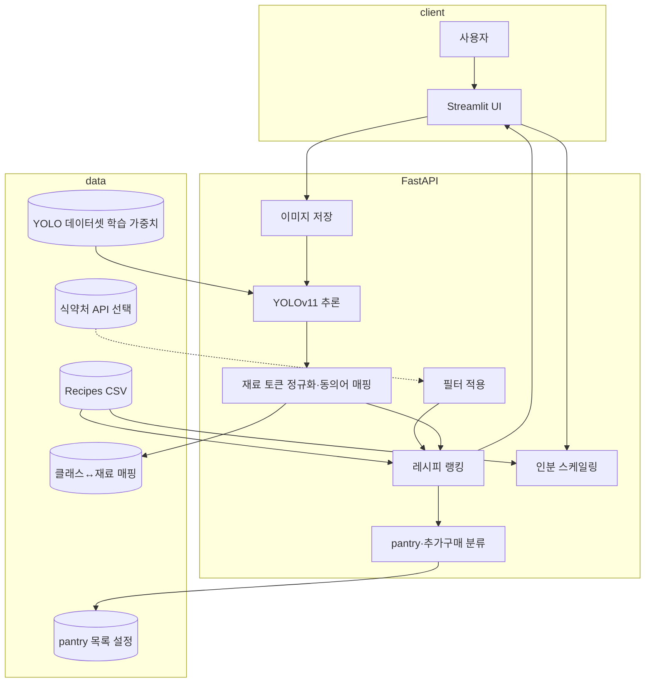

# 딥러닝실습 기말 프로젝트 계획서

> **주제**: 냉장고 사진 기반 재료 인식 및 레시피 추천 end-to-end 시스템  
> **과목**: 딥러닝실습 · **제출**: 계획서(PPT 변환 가능) · 본 문서는 PPT 9개 목차에 맞춰 작성함.

---

## 1. 프로젝트 개요

### 1.1 배경 및 목적

가정 내 식재료 유기·메뉴 결정 비용을 줄이기 위해, **냉장고(및 식료품) 사진**에서 재료를 추론하고, 사용자가 고른 **식사 종류·요리 종류·식단 선호**에 맞춰 **레시피를 추천**하며, 선택한 레시피에 대해 **준비·조리 시간, 인분, 재료(냉장고 보유 / 추가 구매 / pantry)** 및 **단계별 조리법**을 제공하는 시스템을 구축한다.

### 1.2 범위 (요구사항 반영)

| 구분         | 내용                                                                                            |
| ---------- | --------------------------------------------------------------------------------------------- |
| 입력         | 냉장고 등 사진 **다중 업로드**                                                                           |
| 인식         | 객체 탐지로 재료 클래스별 **개수 집계**, 재료 목록 화면·**검색**                                                     |
| 필터 (순차 UI) | **식사**: 아침·점심·저녁·간식·디저트 / **요리**: 한식·일식·이탈리안·중식·아메리칸 / **식단**: 채식·비건·고단백·유제품 없음·저탄수화물·저지방·무설탕 |
| 추천         | 필터 반영 레시피 목록 → 사용자가 항목 선택                                                                     |
| 상세         | 음식 사진·설명, **prep / cook / total**, **서빙 인원**(가변), **재료 개수**, 재료별 용량                           |
| 재료 구분      | **냉장고에서 인식된 재료**, **추가 구매(최대 2개까지 표시)**, **pantry**(물·소금·후추 등 기본 조미·상비)                       |
| 스케일        | 서빙 인원 변경 시 **재료 용량 비례 조정**                                                                    |
| 조리법        | 하단에 **번호 있는 단계**                                                                              |
| 제외         | **난이도 항목은 범위에서 제외**(별도 지표로 두지 않음)                                                             |

### 1.3 기술 목표

- **딥러닝**: 냉장고 도메인 **객체 탐지(YOLOv11)** 학습·추론
- **애플리케이션**: **FastAPI** 추론 API + **Streamlit**(또는 동등) UI, **Docker**로 재현 가능한 실행 환경
- **데이터**: 로컬 **Recipes Dataset** + **스마트 냉장고 YOLO 데이터셋**; 한식 필터 보강 시 **식품의약품안전처 Open API**(조리식품 레시피 등) 활용 검토

---

## 2. 프로젝트 구성도 (Architecture · Flow)

### 2.1 계층 구조

| 계층     | 역할                                                 |
| ------ | -------------------------------------------------- |
| 클라이언트  | 이미지 업로드, 필터·인분·검색 UI                               |
| 애플리케이션 | FastAPI — 업로드 저장, 추론 요청, 레시피 검색·랭킹, 식약처 API 연동(선택) |
| AI     | YOLOv11 추론, 재료명 정규화·매칭 모듈                          |
| 데이터    | CSV 레시피 DB, 동의어/매핑 JSON, pantry 설정 파일              |

### 2.2 사용자 흐름 (요약)

1. 사용자가 사진 1장 이상 업로드 → 서버가 YOLO로 박스 탐지 → 클래스별 개수 합산 → 재료 목록·검색 화면
2. 식사 → 요리 → 식단 필터 입력
3. 탐지 재료 집합 + 필터로 레시피 후보 **점수화·정렬** → 목록 표시
4. 레시피 선택 → 상세: 이미지·시간·인분·재료 수, 재료를 **보유 / 추가구매(상위 2) / pantry**로 분류, 인분에 따른 용량, 단계별 조리법

### 2.3 시스템 흐름도 (Mermaid)

---

## 3. 사용할 데이터셋

### 3.1 이미지·탐지 학습: `smart refrigerator.yolov11/`

| 항목    | 내용                                                                                 |
| ----- | ---------------------------------------------------------------------------------- |
| 용도    | 냉장고/식재료 이미지에서 **객체 탐지** 학습 및 검증                                                    |
| 형식    | YOLO 형식 (`train/images`, `train/labels`, `data.yaml`)                              |
| 클래스 수 | 30 (`apple`, `banana`, `beef`, … `tomato` 등, `data.yaml`의 `names`)                 |
| 비고    | `data.yaml`의 train/val/test 경로를 실제 폴더 구조에 맞게 수정·검증 분할 필요. Roboflow 출처 메타는 라이선스 확인. |

### 3.2 레시피·텍스트: `Recipes Dataset/`

| 파일                 | 용도                                                       |
| ------------------ | -------------------------------------------------------- |
| `recipes.csv`      | 대규모 레시피 메타(시간, 재료 문자열, 조리법, `img_src`, `cuisine_path` 등) |
| `test_recipes.csv` | 재료 **수량·단위·이름** 구조화 → **인분 스케일링**에 우선 활용                 |

영문 Allrecipes 기준이므로 **한식·일식 필터**는 키워드·`cuisine_path` 규칙만으로는 한계가 있어, 필요 시 아래 공공 API로 보강한다.

### 3.3 (선택) 한국어 레시피·필터 보강: 식품의약품안전처 Open API

| 항목  | 내용                                                                                                                                                      |
| --- | ------------------------------------------------------------------------------------------------------------------------------------------------------- |
| 목적  | **한식** 등 한국어 메뉴·분류 기반 필터, 레시피 후보 다양화                                                                                                                    |
| 이용  | [식품안전나라 데이터활용서비스](https://www.foodsafetykorea.go.kr/api/newDatasetDetail.do) — 인증키 발급 후 `openapi.foodsafetykorea.go.kr` 형식으로 호출(서비스 ID·건수 제한은 공식 문서 준수) |
| 일식  | 동 API만으로는 한계가 있을 수 있어 **메뉴명 키워드 규칙** 또는 영문 CSV 쪽과 병행                                                                                                    |

### 3.4 코드·규칙 자원 (별도 파일로 관리)

- **YOLO 클래스명 ↔ 레시피 재료 토큰** 동의어·별칭 매핑(JSON 등)
- **Pantry 후보**: 물·소금·후추 등 — **설정 파일**에서 수정 가능하게 둠

---

## 4. 데이터 전처리

### 4.1 이미지

- 업로드 이미지 리사이즈·패딩을 YOLO 입력 규격에 맞춤  
- (학습 시) Albumentations 등 **기하·색조 증강**으로 일반화  
- 다중 사진: 장별 추론 후 **클래스별 박스 개수 합산**

### 4.2 레시피 텍스트

- 재료 문자열 **토큰화**: 소문자화, 특수문자, 복수·관사 정리  
- **정규화만으로 부족한 부분**은 **YOLO 30클래스용 동의어 사전**(예: `chicken_breast` → recipe 내 `chicken` 매칭 규칙)으로 보완  
- 필터: 식사 종류는 제목·키워드·시간대 휴리스틱; 요리 국가는 `cuisine_path` + (선택) 식약처 메타; 식단은 재료 기반 키워드·금지 재료 규칙(비건·유제품 없음 등)

### 4.3 학습용 split

- YOLO: `train`에서 **validation / test** 분할 또는 `data.yaml` 경로 정합성 확보

---

## 5. 사용할 모델·로직 소개

### 5.1 객체 탐지

- **YOLOv11**(ultralytics 등)로 `smart refrigerator` 데이터셋 **fine-tune** 또는 동 데이터로 학습된 가중치 사용  
- 출력: 클래스 ID, 신뢰도, 바운딩 박스 → 클래스별 **개수 = 동일 클래스 박스 수**

### 5.2 재료·레시피 매칭

- 탐지 클래스 집합을 정규화·매핑한 뒤, 각 레시피의 재료 집합과 **Jaccard 유사도**, **부족 재료 수** 등으로 점수화  
- **추가 구매**: 부족 재료 중 pantry가 아닌 것을 정렬해 **최대 2개**까지 표시(정책으로 조정 가능)  
- **Pantry**: 설정 리스트에 포함된 재료는 “집에 없어도 상비로 간주” 등 규칙으로 표시

### 5.3 인분 스케일링

- `test_recipes.csv` 형식의 quantity·unit·name을 기준으로 **기준 인분 대비 비율**로 양 변환(단위 환산은 단순 규칙부터 적용)

### 5.4 서빙

- **FastAPI**: `POST /predict`(이미지), `GET /recipes`(쿼리: 재료·필터), `GET /recipe/{id}`  
- **Streamlit**: 데모·시연용 UI  
- **Docker**: `requirements` 고정, 추론·API·UI 컨테이너 분리 또는 단일 compose

---

## 6. 성능평가 방안

### 6.1 객체 탐지

- 검증·테스트 세트에서 **[mAP@0.5](mailto:mAP@0.5)**, 클래스별 **Precision / Recall**  
- 혼동이 큰 클래스 쌍은 오류 분석 표로 정리

### 6.2 추천·매칭

- 시뮬레이션: 가상의 “보유 재료 집합”에 대해 **상위 K개 레시피** 중 부족 재료 수·커버리지 분포  
- (선택) 소수 **사용자 시나리오**에 대한 정성 평가(추천이 요리 가능해 보이는지)

### 6.3 시스템

- 이미지당 평균 **추론 시간(ms)**, API 응답 시간  
- Docker 기준 **재현 가능한 실행** 여부

---

## 7. 개발 일정 (예시)

| 주차  | 작업                                            |
| --- | --------------------------------------------- |
| 1   | 요구사항 고정, `data.yaml`·CSV 스키마 정리, 매핑·pantry 초안 |
| 2   | YOLO 데이터 분할·학습 베이스라인, 추론 스크립트                 |
| 3   | 재료 정규화·레시피 랭킹·필터 프로토타입                        |
| 4   | FastAPI 연동, Streamlit 화면(업로드→목록→필터→상세)        |
| 5   | 인분 스케일·추가구매·pantry UI, (선택) 식약처 API           |
| 6   | Docker 정리, 평가 지표 산출, 발표·계획서·시연 영상             |

※ 실제 학기 일정에 맞게 주 단위 조정.

---

## 8. 활용 방안

- 가정 내 식재료 활용 촉진, 음식물 쓰레기 감소에 기여  
- 향후: 바코드·유통기한 연동, 사용자 선호 학습, 모바일 앱 연동  
- 교육: CNN·전이학습·객체 탐지·MLOps(배포·재현성)를 한 프로젝트에서 연습

---

## 9. 참고문헌 (Reference)

1. Ultralytics YOLO / YOLOv11 문서 — [https://docs.ultralytics.com/](https://docs.ultralytics.com/)
2. Roboflow Universe (스마트 냉장고 유사 데이터셋 참고) — [https://universe.roboflow.com/](https://universe.roboflow.com/)
3. Salvador et al., *Learning Cross-modal Embeddings for Cooking Recipes and Food Images* (CVPR 2017) — Recipe1M·im2recipe 맥락
4. 식품의약품안전처, 식품안전나라 **Open API** 이용 안내 — [https://www.foodsafetykorea.go.kr/api/openApiInfo.do](https://www.foodsafetykorea.go.kr/api/openApiInfo.do) · [https://www.foodsafetykorea.go.kr/api/newDatasetDetail.do](https://www.foodsafetykorea.go.kr/api/newDatasetDetail.do)
5. 프로젝트 로컬: `smart refrigerator.yolov11/data.yaml`, `Recipes Dataset/*.csv`
6. (선택) MIT Recipe1M+ — [https://im2recipe.csail.mit.edu/](https://im2recipe.csail.mit.edu/)

---

## 부록: README 요구사항 대응 표

| README 항목              | 구현 포인트                |
| ---------------------- | --------------------- |
| 사진 다중                  | 업로드 리스트 순회 추론 후 집계    |
| 재료 개수·검색               | 클래스별 count, 프론트 필터    |
| 식사·요리·식단 필터            | 규칙 + CSV + (선택) 식약처   |
| 추천 목록·클릭               | 랭킹 결과 테이블             |
| 사진·설명·시간·인분·재료 수       | CSV + `img_src`       |
| 보유 / 추가구매(≤2) / pantry | 매칭 + 설정 파일            |
| 인분별 용량                 | 구조화 재료 × 비율           |
| 단계별 조리법                | `directions` 파싱·번호 부여 |

---

*본 계획서는 `README.md` 및 대화 중 합의한 범위(난이도 제외, 매핑·pantry·식약처 API 방향)를 반영하였다.*